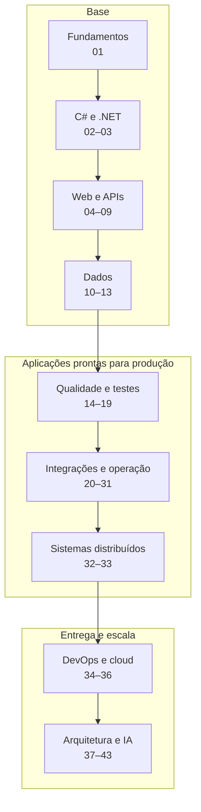
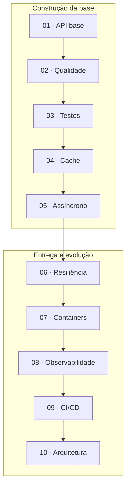

<div align="center">
  <h1>🚀 ASP.NET Core Developer Roadmap</h1>
  <p><strong>Edição 2026 · .NET 10 · C# 14 · ASP.NET Core 10</strong></p>
  <p>Uma trilha progressiva e prática para desenvolver APIs e backends modernos com o ecossistema .NET.</p>
  <p>
    <a href="https://learn.microsoft.com/dotnet/core/whats-new/dotnet-10/overview"></a>
    <a href="https://learn.microsoft.com/dotnet/csharp/whats-new/csharp-14"></a>
    <a href="https://learn.microsoft.com/aspnet/core/release-notes/aspnetcore-10.0?view=aspnetcore-10.0"></a>
    
  </p>
  <p>
    <a href="#comece-aqui">Comece por aqui</a> ·
    <a href="#visao-geral">Visão geral</a> ·
    <a href="#trilhas-por-nivel">Trilhas por nível</a> ·
    <a href="#roadmap-detalhado">Roadmap detalhado</a> ·
    <a href="#projeto-guia">Projeto guia</a>
  </p>
</div>

---

<a id="comece-aqui"></a>

## 👋 Comece por aqui

Este roadmap foi feito para quem está começando no backend com .NET e para quem já trabalha na área, mas quer organizar os próximos passos.

1. **Escolha seu ponto de entrada.** Use as [trilhas por nível](#trilhas-por-nivel) para decidir onde começar.
2. **Estude um módulo por vez.** Priorize os itens essenciais e abra os tópicos avançados quando eles resolverem um problema real.
3. **Pratique continuamente.** Evolua o [projeto guia](#projeto-guia) enquanto avança pela trilha.

> [!NOTE]
> O objetivo é orientar **o que aprender**, **em qual ordem** e **o que pode ficar para depois**. Este não é um checklist de pré-requisitos para conseguir um emprego.

### Como ler as prioridades

| Sinal | Prioridade | Como estudar |
| :---: | :--- | :--- |
| 🔴 | **Essencial** | Aprenda e pratique |
| 🟠 | **Importante** | Conheça e aprofunde conforme a necessidade |
| ⚪ | **Opcional / avançado** | Deixe para um momento posterior |

> [!TIP]
> Não tente estudar tudo ao mesmo tempo. Prefira o ciclo **conceito → prática → feedback → aprofundamento**.

---

<a id="visao-geral"></a>

## 🗺️ Visão geral

A jornada começa nos fundamentos, passa pela construção de APIs e termina em operação, escala e decisões arquiteturais.



**Caminho essencial:** Git → HTTP → C# → .NET → ASP.NET Core → SQL → Entity Framework Core → testes → Docker.

<details>
<summary><strong>Ver índice das macroáreas</strong></summary>

| Macroárea | Módulos |
| :--- | :---: |
| [🧱 Fundamentos](#fundamentos) | 01 |
| [💻 Linguagem e plataforma](#linguagem-e-plataforma) | 02–03 |
| [🌐 Desenvolvimento Web](#desenvolvimento-web) | 04–09 |
| [🗄️ Dados e persistência](#dados-e-persistencia) | 10–13 |
| [🧠 Qualidade e arquitetura](#qualidade-e-arquitetura) | 14–18 |
| [🧪 Testes](#testes) | 19 |
| [🔌 Integrações e resiliência](#integracoes-e-resiliencia) | 20–25 |
| [⚡ Performance, cache e operação](#performance-cache-e-operacao) | 26–31 |
| [📨 Mensageria e sistemas distribuídos](#mensageria-e-sistemas-distribuidos) | 32–33 |
| [📦 DevOps e cloud](#devops) | 34–36 |
| [🏗️ Arquitetura avançada](#arquitetura-avancada) | 37–42 |
| [🤖 IA e ferramentas modernas](#ia-e-ferramentas-modernas) | 43 |

</details>

---

<a id="trilhas-por-nivel"></a>

## 🧭 Trilhas por nível

Use estas trilhas como **pontos de entrada**, não como descrições rígidas de cargo. Experiência profissional depende de contexto, autonomia e impacto — não apenas de uma lista de tecnologias.

| Trilha | Foco principal | Marco prático |
| :--- | :--- | :--- |
| [Júnior](#trilha-junior) | Fundamentos, primeira API, dados e testes | Entregar uma API funcional e containerizada |
| [Pleno](#trilha-pleno) | Arquitetura, resiliência, mensageria e operação | Evoluir e operar uma aplicação em produção |
| [Sênior](#trilha-senior) | System design, escala e decisões arquiteturais | Projetar sistemas e justificar trade-offs |

<a id="trilha-junior"></a>

<details>
<summary><strong>🟢 Desenvolvedor Júnior</strong> — construa uma base sólida e entregue sua primeira API completa.</summary>

**Checklist de referência**

- [ ] Git
- [ ] HTTP
- [ ] C#
- [ ] Orientação a Objetos
- [ ] LINQ
- [ ] Async / Await
- [ ] ASP.NET Core
- [ ] REST API
- [ ] Dependency Injection
- [ ] SQL
- [ ] Entity Framework Core
- [ ] Unit Tests
- [ ] Integration Tests
- [ ] Docker básico

</details>

<a id="trilha-pleno"></a>

<details>
<summary><strong>🔵 Desenvolvedor Pleno</strong> — aprenda a evoluir, integrar e operar aplicações.</summary>

**Checklist de referência**

- [ ] Clean Architecture / Vertical Slice
- [ ] Design Patterns
- [ ] Redis
- [ ] IHttpClientFactory
- [ ] Resiliência
- [ ] RabbitMQ / Service Bus / Kafka
- [ ] MassTransit
- [ ] Outbox
- [ ] Docker
- [ ] CI/CD
- [ ] OpenTelemetry
- [ ] Cloud
- [ ] Performance

</details>

<a id="trilha-senior"></a>

<details>
<summary><strong>🟣 Desenvolvedor Sênior</strong> — aprofunde decisões de arquitetura, escala e confiabilidade.</summary>

**Checklist de referência**

- [ ] System Design
- [ ] Distributed Systems
- [ ] Eventual Consistency
- [ ] Distributed Transactions
- [ ] Saga
- [ ] Outbox
- [ ] Idempotência
- [ ] Performance
- [ ] Observabilidade
- [ ] Microservices
- [ ] Kubernetes
- [ ] Cloud Architecture
- [ ] Scalability
- [ ] High Availability
- [ ] Disaster Recovery
- [ ] SLA / SLO / SLI

</details>

---

<a id="roadmap-detalhado"></a>

## 📚 Roadmap detalhado

Os 43 módulos estão agrupados por assunto. Abra somente o módulo que você está estudando; as caixas permanecem desmarcadas para que você possa copiar ou fazer um fork e acompanhar o próprio progresso.

<a id="fundamentos"></a>

### 🧱 1. Fundamentos

Construa a base comum a qualquer backend: Git, internet, HTTP, APIs, estruturas de dados e algoritmos.

<a id="modulo-01"></a>

<details>
<summary><strong>01 · Fundamentos de Desenvolvimento</strong></summary>

> Antes de aprender .NET, é importante conhecer alguns fundamentos que independem de linguagem.

**🔴 Essencial · Git**

- [ ] Git
- [ ] Repository
- [ ] Commit
- [ ] Push / Pull
- [ ] Branch
- [ ] Merge
- [ ] Rebase
- [ ] Pull Request
- [ ] Merge Conflict
- [ ] `.gitignore`

**🟠 Importante · Estratégias de Branch**

- [ ] Git Flow
- [ ] GitHub Flow
- [ ] Trunk Based Development

**🔴 Essencial · Internet e HTTP**

- [ ] Client / Server
- [ ] IP
- [ ] Porta
- [ ] DNS
- [ ] Domínio
- [ ] HTTP
- [ ] HTTPS
- [ ] TLS

**Métodos HTTP**

- [ ] GET
- [ ] POST
- [ ] PUT
- [ ] PATCH
- [ ] DELETE
- [ ] OPTIONS
- [ ] HEAD

**Status Codes**

- [ ] 1xx
- [ ] 2xx
- [ ] 3xx
- [ ] 4xx
- [ ] 5xx

Entender principalmente:

```text
200 OK
201 Created
202 Accepted
204 No Content

400 Bad Request
401 Unauthorized
403 Forbidden
404 Not Found
409 Conflict
422 Unprocessable Content
429 Too Many Requests

500 Internal Server Error
502 Bad Gateway
503 Service Unavailable
504 Gateway Timeout
```

**🔴 Essencial · APIs e REST**

- [ ] O que é uma API
- [ ] REST
- [ ] Resource
- [ ] URI
- [ ] Path
- [ ] Query String
- [ ] Headers
- [ ] Request
- [ ] Response
- [ ] JSON
- [ ] Content-Type
- [ ] Stateless
- [ ] Idempotência

**🟠 Importante · Estruturas de Dados**

- [ ] Array
- [ ] List
- [ ] Stack
- [ ] Queue
- [ ] Hash Table
- [ ] Dictionary
- [ ] HashSet
- [ ] Linked List
- [ ] Tree
- [ ] Graph

**🟠 Importante · Algoritmos**

- [ ] Busca
- [ ] Ordenação
- [ ] Recursividade
- [ ] Complexidade de algoritmos
- [ ] Big O

Exemplos:

```text
O(1)
O(log n)
O(n)
O(n log n)
O(n²)
```

</details>

<a id="linguagem-e-plataforma"></a>

### 💻 2. Linguagem e plataforma

Aprenda C# moderno e entenda como SDK, runtime, CLI e gerenciamento de memória se relacionam.

<a id="modulo-02"></a>

<details>
<summary><strong>02 · C# 14</strong></summary>

**🔴 Essencial · Fundamentos**

- [ ] Variáveis
- [ ] Tipos primitivos
- [ ] Value Types
- [ ] Reference Types
- [ ] Nullable Types
- [ ] Nullable Reference Types
- [ ] Operadores
- [ ] Condicionais
- [ ] Loops
- [ ] Métodos
- [ ] Parâmetros
- [ ] Named Arguments
- [ ] Optional Parameters

**🔴 Essencial · Orientação a Objetos**

- [ ] Classes
- [ ] Objetos
- [ ] Construtores
- [ ] Properties
- [ ] Fields
- [ ] Encapsulamento
- [ ] Herança
- [ ] Polimorfismo
- [ ] Abstração
- [ ] Interfaces
- [ ] Classes abstratas

**🔴 Essencial · Collections**

- [ ] Array
- [ ] List
- [ ] Dictionary
- [ ] HashSet
- [ ] Queue
- [ ] Stack

**🔴 Essencial · Generics**

- [ ] Generic Classes
- [ ] Generic Methods
- [ ] Generic Interfaces
- [ ] Constraints

**🔴 Essencial · LINQ**

- [ ] Where
- [ ] Select
- [ ] SelectMany
- [ ] First
- [ ] FirstOrDefault
- [ ] Single
- [ ] SingleOrDefault
- [ ] Any
- [ ] All
- [ ] Count
- [ ] OrderBy
- [ ] ThenBy
- [ ] GroupBy
- [ ] Join
- [ ] Distinct
- [ ] Skip
- [ ] Take

Entender:

- [ ] IEnumerable
- [ ] IQueryable
- [ ] Deferred Execution

**🔴 Essencial · Exceptions**

- [ ] try
- [ ] catch
- [ ] finally
- [ ] throw
- [ ] Custom Exceptions
- [ ] Exception Filters

**🔴 Essencial · Async / Await**

- [ ] Task
- [ ] `Task<T>`
- [ ] async
- [ ] await
- [ ] CancellationToken
- [ ] Task.WhenAll
- [ ] Task.WhenAny
- [ ] IAsyncEnumerable
- [ ] Async Streams

Entender a diferença entre:

```text
Concorrência
Paralelismo
Assincronismo
```

**🟠 Importante · Recursos importantes da linguagem**

- [ ] Records
- [ ] Record Structs
- [ ] Structs
- [ ] Enums
- [ ] Tuples
- [ ] Pattern Matching
- [ ] Switch Expressions
- [ ] Extension Methods
- [ ] Delegates
- [ ] Events
- [ ] Lambda Expressions
- [ ] Expression Trees
- [ ] Attributes

**🟠 Importante · C# moderno**

- [ ] Primary Constructors
- [ ] Collection Expressions
- [ ] Required Members
- [ ] Init-only Properties
- [ ] Global Usings
- [ ] File-scoped Namespaces
- [ ] Raw String Literals
- [ ] Generic Math
- [ ] `Span<T>`
- [ ] `ReadOnlySpan<T>`

**C# 14**

- [ ] Extension Members
- [ ] Field-backed Properties com `field`
- [ ] Null-conditional Assignment
- [ ] Unbound Generic Types com `nameof`
- [ ] Conversões implícitas para `Span<T>` e `ReadOnlySpan<T>`
- [ ] Modificadores em parâmetros Lambda (`ref`, `in`, `out`, `scoped`, `ref readonly`)
- [ ] Partial Constructors
- [ ] Partial Events
- [ ] User-defined Compound Assignment Operators
- [ ] Novas diretivas de pré-processador para File-based Apps

</details>

<a id="modulo-03"></a>

<details>
<summary><strong>03 · Ecossistema .NET 10</strong></summary>

**🔴 Essencial · Conceitos**

Entender a diferença entre:

- [ ] .NET
- [ ] SDK
- [ ] Runtime
- [ ] CLR
- [ ] JIT
- [ ] Garbage Collector
- [ ] NuGet

**🔴 Essencial · Estrutura de projetos**

- [ ] Solution
- [ ] Project
- [ ] `.slnx` — formato gerado por padrão por `dotnet new sln` no SDK .NET 10
- [ ] `.sln` — formato tradicional
- [ ] `.csproj`
- [ ] PackageReference
- [ ] ProjectReference

**🔴 Essencial · .NET CLI**

```bash
dotnet new
dotnet restore
dotnet build
dotnet run
dotnet watch
dotnet test
dotnet publish

dotnet package add
dotnet package list
dotnet package remove

dotnet reference add
dotnet reference list
dotnet reference remove
```

> [!NOTE]
> No .NET 10, a CLI passou a oferecer a forma **substantivo primeiro** (`dotnet package add`, `dotnet reference add`).
> Os comandos antigos, como `dotnet add package`, continuam funcionando como aliases.

**🟠 Importante · File-based Apps**

- [ ] Executar aplicações `.cs` sem `.csproj`
- [ ] `dotnet run --file app.cs`
- [ ] `dotnet run app.cs`
- [ ] `dotnet app.cs`
- [ ] `#:package`
- [ ] `#:project`
- [ ] `#:property`
- [ ] `#:sdk`
- [ ] Converter para projeto com `dotnet project convert`

> [!TIP]
> File-based Apps são úteis para scripts, utilitários, exemplos e aplicações pequenas sem a estrutura completa de um projeto tradicional.

**🟠 Importante · Gerenciamento de memória**

- [ ] Stack
- [ ] Heap
- [ ] Garbage Collector
- [ ] GC Generations
- [ ] IDisposable
- [ ] using
- [ ] Finalizers
- [ ] Memory Allocation

**⚪ Avançado**

- [ ] Reflection
- [ ] Source Generators
- [ ] Native AOT (Ahead-of-Time Compilation)
- [ ] Assembly
- [ ] IL
- [ ] Roslyn

</details>

<a id="desenvolvimento-web"></a>

### 🌐 3. Desenvolvimento Web

Crie APIs com ASP.NET Core e domine configuração, pipeline, documentação, validação e segurança.

<a id="modulo-04"></a>

<details>
<summary><strong>04 · ASP.NET Core 10</strong></summary>

**🔴 Essencial · Web API**

- [ ] Criar uma Web API
- [ ] Controllers
- [ ] Minimal APIs
- [ ] Routing
- [ ] Endpoint Routing
- [ ] Model Binding
- [ ] DTO
- [ ] Request
- [ ] Response
- [ ] Status Codes

**🔴 Essencial · Dependency Injection**

- [ ] Dependency Injection
- [ ] Dependency Inversion
- [ ] Constructor Injection
- [ ] IServiceCollection
- [ ] IServiceProvider

**Lifetimes**

- [ ] Transient
- [ ] Scoped
- [ ] Singleton

> [!IMPORTANT]
> Não basta decorar os lifetimes. É importante entender **quando usar cada um** e quais problemas podem surgir ao misturá-los incorretamente.

</details>

<a id="modulo-05"></a>

<details>
<summary><strong>05 · Configuration</strong></summary>

**🔴 Essencial · Configurações**

- [ ] appsettings.json
- [ ] appsettings.Development.json
- [ ] Environment Variables
- [ ] IConfiguration
- [ ] Options Pattern
- [ ] IOptions
- [ ] IOptionsSnapshot
- [ ] IOptionsMonitor

**🔴 Essencial · Secrets**

- [ ] User Secrets
- [ ] Environment Variables

**🟠 Importante · Cloud**

- [ ] Azure Key Vault
- [ ] AWS Secrets Manager

> [!WARNING]
> Nunca armazene senhas, tokens ou connection strings diretamente no código-fonte.

</details>

<a id="modulo-06"></a>

<details>
<summary><strong>06 · ASP.NET Core Pipeline</strong></summary>

**🔴 Essencial · Middleware**

- [ ] Middleware
- [ ] Request Pipeline
- [ ] Middleware customizado
- [ ] Exception Handling Middleware

**🔴 Essencial · Filters (MVC / Controllers)**

- [ ] Authorization Filter
- [ ] Action Filter
- [ ] Exception Filter
- [ ] Result Filter

**🔴 Essencial · Endpoint Filters (Minimal APIs)**

- [ ] `IEndpointFilter`
- [ ] `AddEndpointFilter`

**🔴 Essencial · Error Handling**

- [ ] Global Exception Handling
- [ ] `IExceptionHandler`
- [ ] Problem Details
- [ ] `AddProblemDetails`
- [ ] `IProblemDetailsService`
- [ ] RFC 9457
- [ ] RFC 7807 — legado, substituído pelo RFC 9457
- [ ] Padronização de erros

</details>

<a id="modulo-07"></a>

<details>
<summary><strong>07 · OpenAPI e Documentação</strong></summary>

**🔴 Essencial · OpenAPI**

- [ ] OpenAPI
- [ ] OpenAPI 3.1
- [ ] `Microsoft.AspNetCore.OpenApi`
- [ ] `AddOpenApi`
- [ ] `MapOpenApi`
- [ ] Documentação de endpoints
- [ ] Request Schema
- [ ] Response Schema

**🟠 Importante · Visualização e documentação interativa**

- [ ] Scalar
- [ ] Swagger UI
- [ ] ReDoc
- [ ] Examples
- [ ] API Versioning

**🟠 Importante · Avançado**

- [ ] Document Transformers
- [ ] Operation Transformers
- [ ] Schema Transformers

</details>

<a id="modulo-08"></a>

<details>
<summary><strong>08 · Validação</strong></summary>

**🔴 Essencial · Validação nativa**

- [ ] Validação de Request
- [ ] Data Annotations
- [ ] `Microsoft.Extensions.Validation` (Minimal APIs)
- [ ] `AddValidation` (Minimal APIs)
- [ ] Validação de parâmetros
- [ ] Validação de tipos
- [ ] Validação de propriedades
- [ ] `IValidatableObject`

**🟠 Importante · Bibliotecas**

- [ ] FluentValidation

> [!IMPORTANT]
> **Validação de entrada** e **regra de negócio** são responsabilidades diferentes.
>
> No ASP.NET Core 10, Minimal APIs possuem suporte nativo à validação com `Microsoft.Extensions.Validation`.

</details>

<a id="modulo-09"></a>

<details>
<summary><strong>09 · Segurança</strong></summary>

**🔴 Essencial · Autenticação e autorização**

- [ ] Authentication (autenticação)
- [ ] Authorization (autorização)
- [ ] Bearer tokens e validação de JWT
- [ ] Claims
- [ ] Roles
- [ ] Policies

**🟠 Importante · Identidade e federação**

- [ ] ASP.NET Core Identity
- [ ] OAuth 2.0
- [ ] OpenID Connect
- [ ] Identity Providers

Exemplos:

- Microsoft Entra ID
- Keycloak
- Auth0
- OpenIddict

**🔴 Essencial · Segurança de APIs**

- [ ] CORS
- [ ] CSRF
- [ ] XSS
- [ ] SQL Injection
- [ ] Command Injection
- [ ] Mass Assignment
- [ ] Broken Authentication
- [ ] Broken Access Control
- [ ] Rate Limiting

**🔴 Essencial · OWASP**

- [ ] OWASP Top 10
- [ ] OWASP API Security Top 10

</details>

<a id="dados-e-persistencia"></a>

### 🗄️ 4. Dados e persistência

Modele dados, escreva SQL e trabalhe com Entity Framework Core, Dapper e diferentes bancos.

<a id="modulo-10"></a>

<details>
<summary><strong>10 · SQL</strong></summary>

**🔴 Essencial · Fundamentos**

- [ ] SELECT
- [ ] INSERT
- [ ] UPDATE
- [ ] DELETE
- [ ] WHERE
- [ ] ORDER BY
- [ ] GROUP BY
- [ ] HAVING

**🔴 Essencial · JOIN**

- [ ] INNER JOIN
- [ ] LEFT JOIN
- [ ] RIGHT JOIN
- [ ] FULL JOIN

**🔴 Essencial · Modelagem**

- [ ] Primary Key
- [ ] Foreign Key
- [ ] Unique Constraint
- [ ] Check Constraint
- [ ] Normalização
- [ ] Relacionamentos

**🔴 Essencial · Performance**

- [ ] Index
- [ ] Execution Plan
- [ ] Composite Index
- [ ] Query Performance
- [ ] N+1 Queries

**🔴 Essencial · Transactions**

- [ ] ACID
- [ ] Commit
- [ ] Rollback
- [ ] Isolation Levels
- [ ] Locks
- [ ] Deadlocks

</details>

<a id="modulo-11"></a>

<details>
<summary><strong>11 · Bancos de Dados</strong></summary>

**🔴 Essencial · Relacionais**

Aprender pelo menos um muito bem:

- [ ] SQL Server
- [ ] PostgreSQL

Conhecer:

- [ ] MySQL
- [ ] MariaDB
- [ ] Oracle

**🟠 Importante · NoSQL**

- [ ] MongoDB
- [ ] Redis
- [ ] Cosmos DB
- [ ] DynamoDB

**🟠 Importante · Search Engines / Full-Text Search**

**Conceitos**

- [ ] Full-Text Search
- [ ] Inverted Index
- [ ] Relevance / Ranking
- [ ] Tokenization
- [ ] Indexação
- [ ] Sincronização entre banco e índice

**Ferramentas**

Conhecer pelo menos uma:

- [ ] Elasticsearch
- [ ] OpenSearch
- [ ] Meilisearch

> [!TIP]
> Mais importante do que decorar bancos e ferramentas diferentes é entender **quando usar SQL, NoSQL, cache ou um mecanismo de busca**.

</details>

<a id="modulo-12"></a>

<details>
<summary><strong>12 · Entity Framework Core 10</strong></summary>

**🔴 Essencial · Fundamentos**

- [ ] DbContext
- [ ] DbSet
- [ ] Entities
- [ ] Configuration
- [ ] Fluent API
- [ ] Migrations

**🔴 Essencial · Relacionamentos**

- [ ] One-to-One
- [ ] One-to-Many
- [ ] Many-to-Many

**🔴 Essencial · Queries**

- [ ] LINQ to Entities
- [ ] Include
- [ ] ThenInclude
- [ ] Projection
- [ ] Tracking
- [ ] AsNoTracking

**🟠 Importante · Loading**

- [ ] Eager Loading
- [ ] Explicit Loading
- [ ] Lazy Loading

**🔴 Essencial · Performance**

- [ ] N+1
- [ ] Projection
- [ ] Pagination
- [ ] AsNoTracking
- [ ] Split Queries
- [ ] Compiled Queries
- [ ] ExecuteUpdate / ExecuteUpdateAsync
- [ ] ExecuteDelete / ExecuteDeleteAsync
- [ ] Bulk Operations com bibliotecas externas

**🟠 Importante · Recursos avançados**

- [ ] Transactions
- [ ] Optimistic Concurrency
- [ ] Global Query Filters
- [ ] Named Query Filters
- [ ] Interceptors
- [ ] Value Converters
- [ ] Raw SQL

</details>

<a id="modulo-13"></a>

<details>
<summary><strong>13 · Dapper</strong></summary>

**🟠 Importante**

- [ ] Query
- [ ] QueryAsync
- [ ] Execute
- [ ] ExecuteAsync
- [ ] Parameters
- [ ] Transactions
- [ ] Multi Mapping

Entender as diferenças entre:

```text
Entity Framework Core
        vs
Dapper
        vs
ADO.NET
```

</details>

<a id="qualidade-e-arquitetura"></a>

### 🧠 5. Qualidade e arquitetura

Melhore design, coesão e manutenibilidade antes de avançar para estilos arquiteturais complexos.

<a id="modulo-14"></a>

<details>
<summary><strong>14 · Clean Code</strong></summary>

**🔴 Essencial**

- [ ] Nomes claros
- [ ] Métodos pequenos
- [ ] Baixo acoplamento
- [ ] Alta coesão
- [ ] Separation of Concerns

Conhecer:

- [ ] DRY
- [ ] KISS
- [ ] YAGNI

**🟠 Importante · Code Quality e Static Analysis**

- [ ] `.editorconfig`
- [ ] Roslyn Analyzers
- [ ] Compiler Warnings
- [ ] `TreatWarningsAsErrors`
- [ ] `dotnet format`
- [ ] StyleCop.Analyzers
- [ ] Code Analysis
- [ ] Dependency Vulnerability Scanning

</details>

<a id="modulo-15"></a>

<details>
<summary><strong>15 · SOLID</strong></summary>

**🔴 Essencial**

- [ ] Single Responsibility Principle
- [ ] Open/Closed Principle
- [ ] Liskov Substitution Principle
- [ ] Interface Segregation Principle
- [ ] Dependency Inversion Principle

> [!TIP]
> O objetivo não é decorar as letras do SOLID. O objetivo é entender **qual problema cada princípio tenta resolver**.

</details>

<a id="modulo-16"></a>

<details>
<summary><strong>16 · Design Patterns</strong></summary>

**🟠 Importante · Creational**

- [ ] Factory
- [ ] Abstract Factory
- [ ] Builder
- [ ] Singleton

**🟠 Importante · Structural**

- [ ] Adapter
- [ ] Decorator
- [ ] Facade
- [ ] Proxy

**🟠 Importante · Behavioral**

- [ ] Strategy
- [ ] Chain of Responsibility
- [ ] Observer
- [ ] Mediator
- [ ] Command

> [!NOTE]
> Não utilize Design Patterns apenas porque eles existem. Utilize-os quando houver um problema que justifique sua utilização.

</details>

<a id="modulo-17"></a>

<details>
<summary><strong>17 · Arquitetura</strong></summary>

**🔴 Essencial**

- [ ] Separation of Concerns
- [ ] Layered Architecture
- [ ] Dependency Rule
- [ ] Modularização

**🟠 Importante**

- [ ] Clean Architecture
- [ ] Onion Architecture
- [ ] Hexagonal Architecture
- [ ] Vertical Slice Architecture
- [ ] Modular Monolith

**⚪ Avançado**

- [ ] Domain-Driven Design
- [ ] CQRS
- [ ] Event Driven Architecture
- [ ] Event Sourcing

</details>

<a id="modulo-18"></a>

<details>
<summary><strong>18 · Domain-Driven Design</strong></summary>

**⚪ Avançado**

- [ ] Domain
- [ ] Subdomain
- [ ] Bounded Context
- [ ] Ubiquitous Language
- [ ] Entity
- [ ] Value Object
- [ ] Aggregate
- [ ] Aggregate Root
- [ ] Domain Service
- [ ] Domain Event
- [ ] Repository

</details>

<a id="testes"></a>

### 🧪 6. Testes

Valide comportamento, integrações, contratos, arquitetura e performance com testes automatizados.

<a id="modulo-19"></a>

<details>
<summary><strong>19 · Testes Automatizados</strong></summary>

**🔴 Essencial · Unit Tests**

Escolha inicialmente um framework:

- [ ] xUnit

Também existem:

- NUnit
- MSTest

**🔴 Essencial · Conceitos**

- [ ] Arrange / Act / Assert
- [ ] Test Isolation
- [ ] Test Double
- [ ] Mock
- [ ] Stub
- [ ] Fake

**🟠 Importante · Mocking**

Escolha um:

- [ ] Moq
- [ ] NSubstitute
- [ ] FakeItEasy

**🟠 Importante · Assertions**

- [ ] FluentAssertions

> [!NOTE]
> Verifique a [licença do Fluent Assertions](https://fluentassertions.com/introduction) antes de adotá-lo em uso comercial.

**🟠 Importante · Fake Data**

- [ ] Bogus
- [ ] AutoFixture

**🔴 Essencial · Integration Tests**

- [ ] WebApplicationFactory
- [ ] TestServer
- [ ] Testcontainers
- [ ] Respawn

**🟠 Importante · Architecture Tests**

- [ ] NetArchTest
- [ ] ArchUnitNET

**⚪ Opcional · Snapshot Testing**

- [ ] Verify

**🟠 Importante · Contract Testing**

- [ ] Consumer / Provider Contracts
- [ ] Backward Compatibility
- [ ] API Contract Testing

**🟠 Importante · E2E**

- [ ] Playwright
- [ ] Selenium

**🟠 Importante · Performance Tests**

- [ ] k6
- [ ] JMeter
- [ ] Bombardier
- [ ] NBomber

</details>

<a id="integracoes-e-resiliencia"></a>

### 🔌 7. Integrações e resiliência

Consuma serviços, trate falhas e escolha protocolos, mapeamento e processamento em background.

<a id="modulo-20"></a>

<details>
<summary><strong>20 · API Clients e Comunicação</strong></summary>

**🔴 Essencial · HttpClient**

- [ ] HttpClient
- [ ] IHttpClientFactory
- [ ] Typed Clients
- [ ] Named Clients

**🔴 Essencial · Entender**

- [ ] Connection Pool
- [ ] Timeout
- [ ] DNS
- [ ] Socket Exhaustion
- [ ] CancellationToken

</details>

<a id="modulo-21"></a>

<details>
<summary><strong>21 · Resiliência</strong></summary>

**🔴 Essencial**

- [ ] Timeout
- [ ] Retry
- [ ] Exponential Backoff
- [ ] Circuit Breaker

**🟠 Importante**

- [ ] Rate Limiter
- [ ] Bulkhead / Concurrency Limiter
- [ ] Fallback
- [ ] Hedging
- [ ] Jitter

Conhecer:

- [ ] Microsoft.Extensions.Http.Resilience
- [ ] Polly

> [!IMPORTANT]
> Retry só é seguro quando a operação tolera novas tentativas. Combine-o com idempotência, limites e cancelamento.

</details>

<a id="modulo-22"></a>

<details>
<summary><strong>22 · Idempotência</strong></summary>

**🔴 Essencial**

- [ ] Idempotency Key
- [ ] Duplicate Requests
- [ ] Retry seguro
- [ ] Unique Constraints
- [ ] Estado da operação

```text
Cliente envia pagamento
        ↓
API processa
        ↓
Cliente perde a resposta
        ↓
Cliente envia novamente
        ↓
API NÃO pode processar duas vezes
```

</details>

<a id="modulo-23"></a>

<details>
<summary><strong>23 · Protocolos e Comunicação</strong></summary>

**🔴 Essencial · REST**

- [ ] REST APIs
- [ ] HttpClient

**🟠 Importante · gRPC**

- [ ] Protocol Buffers
- [ ] Unary
- [ ] Server Streaming
- [ ] Client Streaming
- [ ] Bidirectional Streaming

**🟠 Importante · Real Time**

- [ ] Server-Sent Events (SSE)
- [ ] SignalR
- [ ] WebSockets

Entender a diferença:

```text
SSE         → comunicação servidor → cliente
WebSockets  → comunicação bidirecional
SignalR     → abstração de comunicação em tempo real
```

**⚪ Opcional · GraphQL**

- [ ] GraphQL
- [ ] Hot Chocolate

</details>

<a id="modulo-24"></a>

<details>
<summary><strong>24 · Object Mapping</strong></summary>

**🔴 Essencial · Primeiro**

- [ ] Manual Mapping

**🟠 Importante · Depois conheça**

- [ ] Mapperly
- [ ] AutoMapper

> [!NOTE]
> Verifique a [licença do AutoMapper](https://docs.automapper.io/en/latest/License-configuration.html) antes de adotá-lo em uso comercial.

</details>

<a id="modulo-25"></a>

<details>
<summary><strong>25 · Background Processing</strong></summary>

**🔴 Essencial · Nativo**

- [ ] BackgroundService
- [ ] IHostedService

**🟠 Importante · Schedulers**

- [ ] Hangfire
- [ ] Quartz.NET

</details>

<a id="performance-cache-e-operacao"></a>

### ⚡ 8. Performance, cache e operação

Prepare aplicações para produção com cache, logs, observabilidade, health checks e concorrência.

<a id="modulo-26"></a>

<details>
<summary><strong>26 · Cache</strong></summary>

**🔴 Essencial · Conceitos**

- [ ] Cache
- [ ] Cache Hit
- [ ] Cache Miss
- [ ] TTL
- [ ] Cache Invalidation

**🔴 Essencial · Memory Cache**

- [ ] IMemoryCache

**🔴 Essencial · Distributed Cache**

- [ ] IDistributedCache
- [ ] Redis

**🟠 Importante · Hybrid Cache**

- [ ] HybridCache
- [ ] L1 / L2 Cache
- [ ] Cache Stampede
- [ ] Serialization
- [ ] Local + Distributed Cache

**🟠 Importante · Patterns**

- [ ] Cache Aside
- [ ] Read Through
- [ ] Write Through
- [ ] Write Behind

**🟠 Importante · HTTP Cache**

- [ ] Output Cache
- [ ] Response Cache
- [ ] ETag
- [ ] Cache-Control

</details>

<a id="modulo-27"></a>

<details>
<summary><strong>27 · Logging</strong></summary>

**🔴 Essencial**

- [ ] ILogger
- [ ] Log Levels
- [ ] Structured Logging

Log Levels:

```text
Trace
Debug
Information
Warning
Error
Critical
```

**🔴 Essencial · Structured Logging**

Evitar:

```csharp
_logger.LogInformation("Usuário " + userId + " realizou pagamento");
```

Preferir:

```csharp
_logger.LogInformation(
    "Usuário {UserId} realizou pagamento",
    userId);
```

**🟠 Importante · Frameworks**

- [ ] Serilog
- [ ] NLog

</details>

<a id="modulo-28"></a>

<details>
<summary><strong>28 · Observabilidade</strong></summary>

> Os três pilares:
>
> **Logs • Metrics • Traces**

**🔴 Essencial · Distributed Tracing**

- [ ] Trace
- [ ] Span
- [ ] TraceId
- [ ] CorrelationId

**🟠 Importante · OpenTelemetry**

- [ ] Instrumentation
- [ ] Traces
- [ ] Metrics
- [ ] Exporters

**🟠 Importante · Ferramentas**

**Metrics**

- [ ] Prometheus
- [ ] Grafana

**Logs**

- [ ] Seq
- [ ] Elasticsearch / ELK

**Tracing**

- [ ] OpenTelemetry
- [ ] Jaeger
- [ ] Zipkin

**APM**

- [ ] Application Insights
- [ ] Datadog
- [ ] Dynatrace

**🟠 Importante · Alerting**

- [ ] Alert Rules
- [ ] Thresholds
- [ ] Alert Severity
- [ ] Notification Channels
- [ ] Alert Fatigue
- [ ] SLO-based Alerting

**Ferramentas**

- [ ] Grafana Alerting
- [ ] Alertmanager
- [ ] Azure Monitor Alerts
- [ ] Datadog Monitors

</details>

<a id="modulo-29"></a>

<details>
<summary><strong>29 · Health Checks</strong></summary>

**🔴 Essencial**

- [ ] Health Checks
- [ ] Liveness
- [ ] Readiness

```text
Readiness
 ├── SQL
 ├── Redis
 ├── Service Bus
 └── API externa
```

> [!IMPORTANT]
> **Liveness ≠ Readiness.** Liveness indica se o processo está vivo; readiness pode verificar se a aplicação está pronta para receber tráfego e acessar dependências críticas.

</details>

<a id="modulo-30"></a>

<details>
<summary><strong>30 · Performance</strong></summary>

**🔴 Essencial**

- [ ] Async I/O
- [ ] Connection Pooling
- [ ] Database Indexes
- [ ] Pagination
- [ ] Caching
- [ ] Compression
- [ ] N+1 Problem

**🟠 Importante · Ferramentas**

- [ ] BenchmarkDotNet
- [ ] dotnet-counters
- [ ] dotnet-trace
- [ ] dotnet-dump

**🟠 Importante · Métricas**

```text
Throughput
Requests/sec
Latency
P50
P90
P95
P99
Error Rate
CPU
Memory
```

</details>

<a id="modulo-31"></a>

<details>
<summary><strong>31 · Concorrência</strong></summary>

**🟠 Importante · Aplicação**

- [ ] Race Condition
- [ ] Thread Safety
- [ ] Lock
- [ ] SemaphoreSlim
- [ ] ConcurrentDictionary
- [ ] Interlocked

**🟠 Importante · Concorrência distribuída**

- [ ] Optimistic Concurrency
- [ ] Pessimistic Lock
- [ ] Distributed Lock

</details>

<a id="mensageria-e-sistemas-distribuidos"></a>

### 📨 9. Mensageria e sistemas distribuídos

Entenda entrega, duplicidade, idempotência e padrões para comunicação assíncrona confiável.

<a id="modulo-32"></a>

<details>
<summary><strong>32 · Mensageria</strong></summary>

**🔴 Essencial · Conceitos**

- [ ] Message
- [ ] Queue
- [ ] Topic
- [ ] Producer
- [ ] Consumer
- [ ] Publisher
- [ ] Subscriber

**🔴 Essencial · Garantias de entrega**

- [ ] At-most-once
- [ ] At-least-once
- [ ] Exactly-once / Effectively-once
- [ ] Limitações de Exactly-once
- [ ] Duplicate Detection

> [!IMPORTANT]
> Não trate **Exactly-once** como uma simples configuração do broker.
> Em sistemas distribuídos, consumidores idempotentes e tratamento de duplicidade continuam sendo fundamentais.

**🔴 Essencial · Problemas importantes**

- [ ] Retry
- [ ] Duplicate Messages
- [ ] Idempotent Consumer
- [ ] Dead Letter Queue
- [ ] Poison Message
- [ ] Ordering

**🟠 Importante · Message Brokers**

Aprender pelo menos um:

- [ ] RabbitMQ
- [ ] Azure Service Bus
- [ ] Apache Kafka
- [ ] Amazon SQS

**🟠 Importante · Message Bus**

- [ ] MassTransit
- [ ] NServiceBus

</details>

<a id="modulo-33"></a>

<details>
<summary><strong>33 · Patterns para Sistemas Distribuídos</strong></summary>

**🟠 Importante**

- [ ] Outbox Pattern
- [ ] Inbox Pattern
- [ ] Transactional Outbox
- [ ] Idempotent Consumer
- [ ] Saga Pattern
- [ ] Compensating Transaction

**⚪ Avançado**

- [ ] Event Sourcing
- [ ] CQRS
- [ ] Change Data Capture

</details>

<a id="devops"></a>

### 📦 10. DevOps e cloud

Containerize, automatize builds e entregas e publique a aplicação em uma nuvem.

<a id="modulo-34"></a>

<details>
<summary><strong>34 · Docker</strong></summary>

**🔴 Essencial**

- [ ] Container
- [ ] Image
- [ ] Dockerfile
- [ ] Registry
- [ ] Build
- [ ] Run
- [ ] Ports
- [ ] Volumes
- [ ] Environment Variables
- [ ] Networks

**🔴 Essencial · Docker Compose**

Conseguir criar algo semelhante a:

```text
┌───────────────────┐
│ ASP.NET Core API  │
└─────────┬─────────┘
          │
     ┌────┴────┐
     ↓         ↓
 PostgreSQL   Redis
```

**🟠 Importante · Docker**

- [ ] Multi-stage Build
- [ ] Health Check
- [ ] Image Layers
- [ ] Image Size
- [ ] Container Security

</details>

<a id="modulo-35"></a>

<details>
<summary><strong>35 · CI/CD</strong></summary>

```text
Commit
   ↓
Build
   ↓
Unit Tests
   ↓
Integration Tests
   ↓
Security Checks
   ↓
Docker Build
   ↓
Push Image
   ↓
Deploy
```

**🟠 Importante · Ferramentas**

Escolha pelo menos uma:

- [ ] GitHub Actions
- [ ] Azure DevOps Pipelines
- [ ] GitLab CI/CD

**🟠 Importante · Conceitos**

- [ ] Pipeline
- [ ] Artifact
- [ ] Environment
- [ ] Secrets
- [ ] Variables
- [ ] Approval
- [ ] Rollback

</details>

<a id="modulo-36"></a>

<details>
<summary><strong>36 · Cloud</strong></summary>

> Não é necessário conhecer todas as clouds. Escolha uma inicialmente.

**🟠 Importante · Azure**

- [ ] App Service
- [ ] Container Apps
- [ ] Azure Functions
- [ ] Azure SQL
- [ ] Storage Account
- [ ] Service Bus
- [ ] Key Vault
- [ ] Application Insights
- [ ] Azure Container Registry
- [ ] AKS

**🟠 Importante · AWS**

- [ ] EC2
- [ ] ECS
- [ ] EKS
- [ ] Lambda
- [ ] RDS
- [ ] S3
- [ ] SQS
- [ ] SNS
- [ ] Secrets Manager
- [ ] CloudWatch

</details>

<a id="arquitetura-avancada"></a>

### 🏗️ 11. Arquitetura avançada

Aprofunde system design, microservices, Kubernetes, Aspire e arquiteturas orientadas a eventos.

<a id="modulo-37"></a>

<details>
<summary><strong>37 · Microservices</strong></summary>

> [!WARNING]
> Aprenda a construir um **bom monólito** antes de construir microservices.

**🟠 Importante · Conceitos**

- [ ] Monolith
- [ ] Modular Monolith
- [ ] Microservices

**🟠 Importante · Microservices**

- [ ] Service Boundaries
- [ ] Database per Service
- [ ] Synchronous Communication
- [ ] Asynchronous Communication
- [ ] Eventual Consistency
- [ ] Service Discovery
- [ ] API Gateway
- [ ] Distributed Transactions

**🟠 Importante · API Gateway**

- [ ] YARP

</details>

<a id="modulo-38"></a>

<details>
<summary><strong>38 · Kubernetes</strong></summary>

**⚪ Avançado**

> Antes de Kubernetes, domine Docker.

- [ ] Cluster
- [ ] Node
- [ ] Pod
- [ ] ReplicaSet
- [ ] Deployment
- [ ] Service
- [ ] Namespace
- [ ] ConfigMap
- [ ] Secret
- [ ] Ingress
- [ ] PersistentVolume (PV)
- [ ] PersistentVolumeClaim (PVC)

**⚪ Opcional · Kubernetes para aplicações**

- [ ] Resource Requests
- [ ] Resource Limits
- [ ] Liveness Probe
- [ ] Readiness Probe
- [ ] Horizontal Pod Autoscaler
- [ ] Rolling Update
- [ ] Rollback

**⚪ Opcional · Ferramentas**

- [ ] kubectl
- [ ] Helm
- [ ] K9s

</details>

<a id="modulo-39"></a>

<details>
<summary><strong>39 · Aspire</strong></summary>

**🟠 Importante**

- [ ] Aspire CLI
- [ ] Aspire Dashboard
- [ ] AppHost
- [ ] Service Defaults
- [ ] Integrations
- [ ] Service Discovery
- [ ] OpenTelemetry
- [ ] Health Checks
- [ ] Local Development
- [ ] Local Orchestration
- [ ] Distributed Applications

> O Aspire pode facilitar o desenvolvimento, a orquestração local e a observabilidade de aplicações distribuídas.

</details>

<a id="modulo-40"></a>

<details>
<summary><strong>40 · System Design</strong></summary>

**🟠 Importante · Fundamentos**

- [ ] Scalability
- [ ] Availability
- [ ] Reliability
- [ ] Fault Tolerance
- [ ] Horizontal Scaling
- [ ] Vertical Scaling

**🟠 Importante · Load Balancing**

- [ ] Load Balancer
- [ ] Reverse Proxy

**🟠 Importante · Dados**

- [ ] Replication
- [ ] Partitioning
- [ ] Sharding

**🟠 Importante · Consistência**

- [ ] Strong Consistency
- [ ] Eventual Consistency
- [ ] CAP Theorem

**🟠 Importante · Disponibilidade**

- [ ] SLA
- [ ] SLI
- [ ] SLO

**🟠 Importante · Disaster Recovery**

- [ ] Backup
- [ ] Restore
- [ ] RPO
- [ ] RTO

</details>

<a id="modulo-41"></a>

<details>
<summary><strong>41 · API Design</strong></summary>

**🔴 Essencial**

- [ ] Resource Naming
- [ ] HTTP Semantics
- [ ] Status Codes
- [ ] Pagination
- [ ] Filtering
- [ ] Sorting
- [ ] Validation
- [ ] Error Responses

**🟠 Importante**

- [ ] API Versioning
- [ ] Idempotency
- [ ] Rate Limiting
- [ ] Correlation ID
- [ ] OpenAPI
- [ ] Backward Compatibility

</details>

<a id="modulo-42"></a>

<details>
<summary><strong>42 · Arquitetura Orientada a Eventos</strong></summary>

**⚪ Avançado**

- [ ] Event Notification
- [ ] Event-Carried State Transfer
- [ ] Eventual Consistency
- [ ] Event Schema
- [ ] Event Versioning

</details>

<a id="ia-e-ferramentas-modernas"></a>

### 🤖 12. IA e ferramentas modernas

Use assistentes com senso crítico e conheça os fundamentos para integrar LLMs às aplicações.

<a id="modulo-43"></a>

<details>
<summary><strong>43 · IA e LLMs</strong></summary>

**🟠 Importante · Desenvolvimento**

- [ ] GitHub Copilot
- [ ] ChatGPT
- [ ] Claude

Também saber:

- [ ] Revisar código gerado
- [ ] Validar respostas
- [ ] Não enviar secrets
- [ ] Não confiar cegamente em código gerado

**⚪ Opcional · Integração com aplicações**

- [ ] OpenAI .NET SDK
- [ ] Semantic Kernel
- [ ] Microsoft.Extensions.AI

**⚪ Opcional · Conceitos**

- [ ] LLM
- [ ] Token
- [ ] Context Window
- [ ] Prompt
- [ ] Embeddings
- [ ] Vector Search
- [ ] RAG
- [ ] Tool Calling / Function Calling

</details>

---

<a id="projeto-guia"></a>

## 🧪 Projeto guia: evolua uma única aplicação

A melhor forma de percorrer o roadmap é aplicar cada conceito no **mesmo projeto**. A sugestão abaixo parte de uma API de e-commerce e a leva, passo a passo, até um cenário próximo de produção.



<a id="etapa-01"></a>

<details>
<summary><strong>Etapa 01 · API Base</strong></summary>

Criar uma API de e-commerce:

```text
Customer
Product
Order
Payment
```

Utilizando:

- ASP.NET Core
- C#
- SQL
- Entity Framework Core

</details>

<a id="etapa-02"></a>

<details>
<summary><strong>Etapa 02 · Qualidade da API</strong></summary>

Adicionar:

- Validation
- Authentication
- Authorization
- JWT
- Exception Handling
- OpenAPI
- Logging

</details>

<a id="etapa-03"></a>

<details>
<summary><strong>Etapa 03 · Testes</strong></summary>

Adicionar:

- Unit Tests
- Integration Tests
- Testcontainers

</details>

<a id="etapa-04"></a>

<details>
<summary><strong>Etapa 04 · Cache</strong></summary>

Adicionar Redis:

```text
GET /products/{id}

       ↓

     Redis
       ↓
 Cache Hit?
  ↙       ↘
SIM       NÃO
 ↓         ↓
Return    Database
```

</details>

<a id="etapa-05"></a>

<details>
<summary><strong>Etapa 05 · Processamento Assíncrono</strong></summary>

```text
Order API
    │
    ▼
Message Broker
    │
    ├────► Payment Worker
    │
    ├────► Email Worker
    │
    └────► Stock Worker
```

</details>

<a id="etapa-06"></a>

<details>
<summary><strong>Etapa 06 · Resiliência</strong></summary>

Adicionar:

- Idempotência
- Retry
- Circuit Breaker
- Dead Letter Queue
- Outbox Pattern

</details>

<a id="etapa-07"></a>

<details>
<summary><strong>Etapa 07 · Containers</strong></summary>

```text
Docker Compose

├── API
├── Worker
├── PostgreSQL
├── Redis
└── RabbitMQ
```

</details>

<a id="etapa-08"></a>

<details>
<summary><strong>Etapa 08 · Observabilidade</strong></summary>

```text
Application
    │
    ▼
OpenTelemetry
    │
    ├── Logs
    ├── Metrics
    └── Traces
```

</details>

<a id="etapa-09"></a>

<details>
<summary><strong>Etapa 09 · CI/CD</strong></summary>

```text
Git Push
   ↓
Build
   ↓
Tests
   ↓
Docker Build
   ↓
Registry
   ↓
Deploy
```

</details>

<a id="etapa-10"></a>

<details>
<summary><strong>Etapa 10 · Arquitetura Avançada</strong></summary>

Somente depois avaliar:

```text
Modular Monolith
       ↓
Microservices
       ↓
Kubernetes
```

</details>

---

<a id="principios-de-estudo"></a>

## 🧠 Princípios de estudo

- **Fundamentos antes de ferramentas.** Entenda o problema antes de escolher uma biblioteca ou serviço.
- **Uma implementação por vez.** Aprenda bem um banco relacional, um broker e uma cloud antes de comparar alternativas.
- **Complexidade sob demanda.** Um bom monólito costuma ser o melhor ponto de partida; microservices e Kubernetes entram quando há justificativa.
- **Prática acima de coleção de tópicos.** Cada módulo deve produzir código, testes, documentação ou uma decisão registrada.

> **Regra de ouro:** conceito → implementação → ferramenta.

<details>
<summary><strong>Perguntas para avaliar uma nova tecnologia</strong></summary>

- Qual problema ela resolve?
- Quando ela não deve ser utilizada?
- Quais alternativas existem?
- Como ela se comporta diante de falhas?
- Qual custo operacional e de manutenção ela adiciona?

</details>

---

<a id="resultado-esperado"></a>

## 🏆 Resultado esperado

Ao final da trilha, você deve conseguir construir, entregar e evoluir uma aplicação backend com decisões técnicas justificadas.

<details>
<summary><strong>Ver competências finais</strong></summary>

- Projetar uma API
- Implementar utilizando ASP.NET Core
- Modelar um banco de dados
- Utilizar Entity Framework Core
- Criar testes automatizados
- Implementar autenticação e autorização
- Integrar APIs externas
- Trabalhar com cache
- Trabalhar com mensageria
- Criar aplicações resilientes
- Implementar observabilidade
- Containerizar aplicações
- Criar pipelines CI/CD
- Fazer deploy em cloud
- Diagnosticar problemas de performance
- Entender sistemas distribuídos
- Tomar decisões arquiteturais justificadas

</details>

---

<a id="referencias"></a>

## 🤝 Referências, contribuição e licença

### Referência

Este roadmap foi inspirado e adaptado do projeto [ASP.NET Core Developer Roadmap](https://github.com/MoienTajik/AspNetCore-Developer-Roadmap), de **Moien Tajik**. A estrutura desta versão foi reorganizada com foco didático, progressão de aprendizado e no ecossistema **.NET 10**.

Para aprofundar os conteúdos, priorize as fontes oficiais:

- [.NET 10](https://learn.microsoft.com/dotnet/core/whats-new/dotnet-10/overview)
- [C# 14](https://learn.microsoft.com/dotnet/csharp/whats-new/csharp-14)
- [ASP.NET Core 10](https://learn.microsoft.com/aspnet/core/release-notes/aspnetcore-10.0?view=aspnetcore-10.0)
- [Entity Framework Core 10](https://learn.microsoft.com/ef/core/what-is-new/ef-core-10.0/whatsnew)

### Contribuição

O roadmap não é uma lista definitiva. Sugestões e correções são bem-vindas: [abra uma issue](https://github.com/v1nifelix/aspnetcore-roadmap/issues/new) ou [envie um pull request](https://github.com/v1nifelix/aspnetcore-roadmap/pulls).

### Licença

Esta adaptação é distribuída sob a licença [CC BY-NC-SA 4.0 — Attribution-NonCommercial-ShareAlike 4.0 International](https://creativecommons.org/licenses/by-nc-sa/4.0/), preservando a atribuição ao trabalho original e a indicação das alterações realizadas.

<p align="center"><sub>Ferramentas mudam. Fundamentos permanecem.</sub></p>
