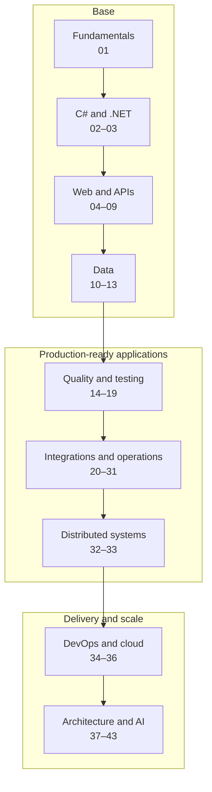
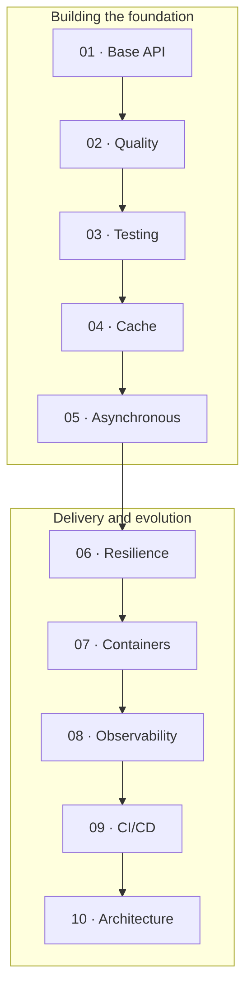

<div align="center">
  <h1>🚀 ASP.NET Core Developer Roadmap</h1>
  <p><strong>2026 Edition · .NET 10 · C# 14 · ASP.NET Core 10</strong></p>
  <p>A progressive, hands-on learning path for building modern APIs and backends with the .NET ecosystem.</p>
  <p><a href="./README.md">Português</a> · <strong>English</strong></p>
  <p>
    <a href="https://learn.microsoft.com/dotnet/core/whats-new/dotnet-10/overview"></a>
    <a href="https://learn.microsoft.com/dotnet/csharp/whats-new/csharp-14"></a>
    <a href="https://learn.microsoft.com/aspnet/core/release-notes/aspnetcore-10.0?view=aspnetcore-10.0"></a>
    
  </p>
  <p>
    <a href="#start-here">Start here</a> ·
    <a href="#overview">Overview</a> ·
    <a href="#paths-by-level">Paths by level</a> ·
    <a href="#detailed-roadmap">Detailed roadmap</a> ·
    <a href="#guide-project">Guide project</a>
  </p>
</div>

---

<a id="start-here"></a>

## 👋 Start here

This roadmap is for people getting started with .NET backend development and for experienced developers who want to organize their next steps.

1. **Choose your starting point.** Use the [paths by level](#paths-by-level) to decide where to begin.
2. **Study one module at a time.** Prioritize essential items and explore advanced topics when they solve a real problem.
3. **Practice continuously.** Evolve the [guide project](#guide-project) as you progress through the roadmap.

> [!NOTE]
> The goal is to guide **what to learn**, **in what order**, and **what can wait until later**. This is not a checklist of prerequisites for getting a job.

### How to read the priorities

| Symbol | Priority | How to approach it |
| :---: | :--- | :--- |
| 🔴 | **Essential** | Learn and practice |
| 🟠 | **Important** | Become familiar and go deeper as needed |
| ⚪ | **Optional / advanced** | Leave it for later |

> [!TIP]
> Do not try to study everything at once. Prefer the cycle **concept → practice → feedback → deeper learning**.

---

<a id="overview"></a>

## 🗺️ Overview

The journey starts with the fundamentals, moves through API development, and ends with operations, scale, and architectural decisions.



**Essential path:** Git → HTTP → C# → .NET → ASP.NET Core → SQL → Entity Framework Core → testing → Docker.

<br />

<details>
<summary><strong>View the main areas</strong></summary>

<br />

| Main area | Modules |
| :--- | :---: |
| [🧱 Fundamentals](#fundamentals) | 01 |
| [💻 Language and platform](#language-and-platform) | 02–03 |
| [🌐 Web development](#web-development) | 04–09 |
| [🗄️ Data and persistence](#data-and-persistence) | 10–13 |
| [🧠 Quality and architecture](#quality-and-architecture) | 14–18 |
| [🧪 Testing](#testing) | 19 |
| [🔌 Integrations and resilience](#integrations-and-resilience) | 20–25 |
| [⚡ Performance, cache, and operations](#performance-cache-and-operations) | 26–31 |
| [📨 Messaging and distributed systems](#messaging-and-distributed-systems) | 32–33 |
| [📦 DevOps and cloud](#devops) | 34–36 |
| [🏗️ Advanced architecture](#advanced-architecture) | 37–42 |
| [🤖 AI and modern tools](#ai-and-modern-tools) | 43 |

</details>

---

<a id="paths-by-level"></a>

## 🧭 Paths by level

Use these paths as **starting points**, not as rigid job-level descriptions. Professional experience depends on context, autonomy, and impact—not just on a list of technologies.

| Path | Main focus | Practical milestone |
| :--- | :--- | :--- |
| [Junior](#junior-path) | Fundamentals, first API, data, and testing | Deliver a functional, containerized API |
| [Mid-level](#mid-level-path) | Architecture, resilience, messaging, and operations | Evolve and operate an application in production |
| [Senior](#senior-path) | System design, scale, and architectural decisions | Design systems and justify trade-offs |

<a id="junior-path"></a>

<br />

<details>
<summary><strong>🟢 Junior Developer</strong> — build a solid foundation and deliver your first complete API.</summary>

<br />

**Reference checklist**

- [✅] Git   Git e uma ferramenta de versionamento que permite que varias pessoas trabalhem  no mesmo projeto e ate na mesma branch. Podemos sempre esta voltando na versão anterior caso precise, mas nao ideal fazer isso.. So devemos tomar cuidado na hora de realizar um merge, pq a branch principal deve estar sempre atualizada e estável para evitar conflitos e garantir a integridade do projeto
- [ ✅] HTTP  HTTP conexão entre o servidor e o usuario, o navegador envia uma requisição http para o servidor que recebe a solicitação, processa a requisição e retorna uma resposta. essa resposta pode conter uma imagem, uma pagina em html, etc.... os principais verbos sao GET,POST,PUT e DELET. esse outros mas esses sao os mais ultilizado
Tem os codigos de status  divido em categoria com 2xx,3xx,4xx,5xx. Os amis ultilizado sao 2xx(status de sucesso), 4xx(erro do cliente) e 5xx(erro 'do servidor).
- [ ] C#
- [ ] Object-Oriented Programming
- [ ] LINQ
- [ ] Async / Await
- [ ] ASP.NET Core
- [ ] REST API
- [ ] Dependency Injection
- [ ] SQL
- [ ] Entity Framework Core
- [ ] Unit Tests
- [ ] Integration Tests
- [ ] Docker basics

</details>

<a id="mid-level-path"></a>

<br />

<details>
<summary><strong>🔵 Mid-level Developer</strong> — learn to evolve, integrate, and operate applications.</summary>

<br />

**Reference checklist**

- [ ] Clean Architecture / Vertical Slice
- [ ] Design Patterns
- [ ] Redis
- [ ] IHttpClientFactory
- [ ] Resilience
- [ ] RabbitMQ / Service Bus / Kafka
- [ ] MassTransit
- [ ] Outbox
- [ ] Docker
- [ ] CI/CD
- [ ] OpenTelemetry
- [ ] Cloud
- [ ] Performance

</details>

<a id="senior-path"></a>

<br />

<details>
<summary><strong>🟣 Senior Developer</strong> — deepen your knowledge of architecture, scale, and reliability decisions.</summary>

<br />

**Reference checklist**

- [ ] System Design
- [ ] Distributed Systems
- [ ] Eventual Consistency
- [ ] Distributed Transactions
- [ ] Saga
- [ ] Outbox
- [ ] Idempotency
- [ ] Performance
- [ ] Observability
- [ ] Microservices
- [ ] Kubernetes
- [ ] Cloud Architecture
- [ ] Scalability
- [ ] High Availability
- [ ] Disaster Recovery
- [ ] SLA / SLO / SLI

</details>

---

<a id="detailed-roadmap"></a>

## 📚 Detailed roadmap

The 43 modules are grouped by subject. Open only the module you are studying; the checkboxes remain empty so you can copy or fork the repository and track your own progress.

<a id="fundamentals"></a>

### 🧱 1. Fundamentals

Build the foundation common to any backend: Git, the internet, HTTP, APIs, data structures, and algorithms.

<a id="module-01"></a>

<br />

<details>
<summary><strong>01 · Development Fundamentals</strong></summary>

<br />

> Before learning .NET, it is important to understand some language-independent fundamentals.

**🔴 Essential · Git**

- [ ] Git
- [ ] Repository
- [ ] Commit
- [ ] Push / Pull
- [ ] Branch
- [ ] Merge
- [ ] Rebase
- [ ] Pull Request
- [ ] Merge Conflict
- [ ] `.gitignore`

**🟠 Important · Branching Strategies**

- [ ] Git Flow
- [ ] GitHub Flow
- [ ] Trunk Based Development

**🔴 Essential · Internet and HTTP**

- [ ] Client / Server
- [ ] IP
- [ ] Port
- [ ] DNS
- [ ] Domain
- [ ] HTTP
- [ ] HTTPS
- [ ] TLS

**HTTP Methods**

- [ ] GET
- [ ] POST
- [ ] PUT
- [ ] PATCH
- [ ] DELETE
- [ ] OPTIONS
- [ ] HEAD

**Status Codes**

- [ ] 1xx
- [ ] 2xx
- [ ] 3xx
- [ ] 4xx
- [ ] 5xx

Focus on understanding:

```text
200 OK
201 Created
202 Accepted
204 No Content

400 Bad Request
401 Unauthorized
403 Forbidden
404 Not Found
409 Conflict
422 Unprocessable Content
429 Too Many Requests

500 Internal Server Error
502 Bad Gateway
503 Service Unavailable
504 Gateway Timeout
```

**🔴 Essential · APIs and REST**

- [ ] What an API is
- [ ] REST
- [ ] Resource
- [ ] URI
- [ ] Path
- [ ] Query String
- [ ] Headers
- [ ] Request
- [ ] Response
- [ ] JSON
- [ ] Content-Type
- [ ] Stateless
- [ ] Idempotency

**🟠 Important · Data Structures**

- [ ] Array
- [ ] List
- [ ] Stack
- [ ] Queue
- [ ] Hash Table
- [ ] Dictionary
- [ ] HashSet
- [ ] Linked List
- [ ] Tree
- [ ] Graph

**🟠 Important · Algorithms**

- [ ] Searching
- [ ] Sorting
- [ ] Recursion
- [ ] Algorithmic complexity
- [ ] Big O

Examples:

```text
O(1)
O(log n)
O(n)
O(n log n)
O(n²)
```

</details>

---

<a id="language-and-platform"></a>

### 💻 2. Language and platform

Learn modern C# and understand how the SDK, runtime, CLI, and memory management relate to one another.

<a id="module-02"></a>

<br />

<details>
<summary><strong>02 · C# 14</strong></summary>

<br />

**🔴 Essential · Fundamentals**

- [ ] Variables
- [ ] Primitive Types
- [ ] Value Types
- [ ] Reference Types
- [ ] Nullable Types
- [ ] Nullable Reference Types
- [ ] Operators
- [ ] Conditionals
- [ ] Loops
- [ ] Methods
- [ ] Parameters
- [ ] Named Arguments
- [ ] Optional Parameters

**🔴 Essential · Object-Oriented Programming**

- [ ] Classes
- [ ] Objects
- [ ] Constructors
- [ ] Properties
- [ ] Fields
- [ ] Encapsulation
- [ ] Inheritance
- [ ] Polymorphism
- [ ] Abstraction
- [ ] Interfaces
- [ ] Abstract Classes

**🔴 Essential · Collections**

- [ ] Array
- [ ] List
- [ ] Dictionary
- [ ] HashSet
- [ ] Queue
- [ ] Stack

**🔴 Essential · Generics**

- [ ] Generic Classes
- [ ] Generic Methods
- [ ] Generic Interfaces
- [ ] Constraints

**🔴 Essential · LINQ**

- [ ] Where
- [ ] Select
- [ ] SelectMany
- [ ] First
- [ ] FirstOrDefault
- [ ] Single
- [ ] SingleOrDefault
- [ ] Any
- [ ] All
- [ ] Count
- [ ] OrderBy
- [ ] ThenBy
- [ ] GroupBy
- [ ] Join
- [ ] Distinct
- [ ] Skip
- [ ] Take

Understand:

- [ ] IEnumerable
- [ ] IQueryable
- [ ] Deferred Execution

**🔴 Essential · Exceptions**

- [ ] try
- [ ] catch
- [ ] finally
- [ ] throw
- [ ] Custom Exceptions
- [ ] Exception Filters

**🔴 Essential · Async / Await**

- [ ] Task
- [ ] `Task<T>`
- [ ] async
- [ ] await
- [ ] CancellationToken
- [ ] Task.WhenAll
- [ ] Task.WhenAny
- [ ] IAsyncEnumerable
- [ ] Async Streams

Understand the difference between:

```text
Concurrency
Parallelism
Asynchrony
```

**🟠 Important · Key Language Features**

- [ ] Records
- [ ] Record Structs
- [ ] Structs
- [ ] Enums
- [ ] Tuples
- [ ] Pattern Matching
- [ ] Switch Expressions
- [ ] Extension Methods
- [ ] Delegates
- [ ] Events
- [ ] Lambda Expressions
- [ ] Expression Trees
- [ ] Attributes

**🟠 Important · Modern C#**

- [ ] Primary Constructors
- [ ] Collection Expressions
- [ ] Required Members
- [ ] Init-only Properties
- [ ] Global Usings
- [ ] File-scoped Namespaces
- [ ] Raw String Literals
- [ ] Generic Math
- [ ] `Span<T>`
- [ ] `ReadOnlySpan<T>`

**C# 14**

- [ ] Extension Members
- [ ] Field-backed Properties with `field`
- [ ] Null-conditional Assignment
- [ ] Unbound Generic Types with `nameof`
- [ ] Implicit conversions to `Span<T>` and `ReadOnlySpan<T>`
- [ ] Lambda parameter modifiers (`ref`, `in`, `out`, `scoped`, `ref readonly`)
- [ ] Partial Constructors
- [ ] Partial Events
- [ ] User-defined Compound Assignment Operators
- [ ] New preprocessor directives for File-based Apps

</details>

<a id="module-03"></a>

<br />

<details>
<summary><strong>03 · .NET 10 Ecosystem</strong></summary>

<br />

**🔴 Essential · Concepts**

Understand the difference between:

- [ ] .NET
- [ ] SDK
- [ ] Runtime
- [ ] CLR
- [ ] JIT
- [ ] Garbage Collector
- [ ] NuGet

**🔴 Essential · Project Structure**

- [ ] Solution
- [ ] Project
- [ ] `.slnx` — the format generated by default by `dotnet new sln` in the .NET 10 SDK
- [ ] `.sln` — the traditional format
- [ ] `.csproj`
- [ ] PackageReference
- [ ] ProjectReference

**🔴 Essential · .NET CLI**

```bash
dotnet new
dotnet restore
dotnet build
dotnet run
dotnet watch
dotnet test
dotnet publish

dotnet package add
dotnet package list
dotnet package remove

dotnet reference add
dotnet reference list
dotnet reference remove
```

> [!NOTE]
> In .NET 10, the CLI introduced the **noun-first** form (`dotnet package add`, `dotnet reference add`).
> Older commands, such as `dotnet add package`, continue to work as aliases.

**🟠 Important · File-based Apps**

- [ ] Run `.cs` applications without a `.csproj`
- [ ] `dotnet run --file app.cs`
- [ ] `dotnet run app.cs`
- [ ] `dotnet app.cs`
- [ ] `#:package`
- [ ] `#:project`
- [ ] `#:property`
- [ ] `#:sdk`
- [ ] Convert to a project with `dotnet project convert`

> [!TIP]
> File-based Apps are useful for scripts, utilities, examples, and small applications that do not need the full structure of a traditional project.

**🟠 Important · Memory Management**

- [ ] Stack
- [ ] Heap
- [ ] Garbage Collector
- [ ] GC Generations
- [ ] IDisposable
- [ ] using
- [ ] Finalizers
- [ ] Memory Allocation

**⚪ Advanced**

- [ ] Reflection
- [ ] Source Generators
- [ ] Native AOT (Ahead-of-Time Compilation)
- [ ] Assembly
- [ ] IL
- [ ] Roslyn

</details>

---

<a id="web-development"></a>

### 🌐 3. Web development

Build APIs with ASP.NET Core and master configuration, the request pipeline, documentation, validation, and security.

<a id="module-04"></a>

<br />

<details>
<summary><strong>04 · ASP.NET Core 10</strong></summary>

<br />

**🔴 Essential · Web API**

- [ ] Create a Web API
- [ ] Controllers
- [ ] Minimal APIs
- [ ] Routing
- [ ] Endpoint Routing
- [ ] Model Binding
- [ ] DTO
- [ ] Request
- [ ] Response
- [ ] Status Codes

**🔴 Essential · Dependency Injection**

- [ ] Dependency Injection
- [ ] Dependency Inversion
- [ ] Constructor Injection
- [ ] IServiceCollection
- [ ] IServiceProvider

**Lifetimes**

- [ ] Transient
- [ ] Scoped
- [ ] Singleton

> [!IMPORTANT]
> Memorizing the lifetimes is not enough. You need to understand **when to use each one** and which problems can arise when they are mixed incorrectly.

</details>

<a id="module-05"></a>

<br />

<details>
<summary><strong>05 · Configuration</strong></summary>

<br />

**🔴 Essential · Configuration**

- [ ] appsettings.json
- [ ] appsettings.Development.json
- [ ] Environment Variables
- [ ] IConfiguration
- [ ] Options Pattern
- [ ] IOptions
- [ ] IOptionsSnapshot
- [ ] IOptionsMonitor

**🔴 Essential · Secrets**

- [ ] User Secrets
- [ ] Environment Variables

**🟠 Important · Cloud**

- [ ] Azure Key Vault
- [ ] AWS Secrets Manager

> [!WARNING]
> Never store passwords, tokens, or connection strings directly in source code.

</details>

<a id="module-06"></a>

<br />

<details>
<summary><strong>06 · ASP.NET Core Pipeline</strong></summary>

<br />

**🔴 Essential · Middleware**

- [ ] Middleware
- [ ] Request Pipeline
- [ ] Custom Middleware
- [ ] Exception Handling Middleware

**🔴 Essential · Filters (MVC / Controllers)**

- [ ] Authorization Filter
- [ ] Action Filter
- [ ] Exception Filter
- [ ] Result Filter

**🔴 Essential · Endpoint Filters (Minimal APIs)**

- [ ] `IEndpointFilter`
- [ ] `AddEndpointFilter`

**🔴 Essential · Error Handling**

- [ ] Global Exception Handling
- [ ] `IExceptionHandler`
- [ ] Problem Details
- [ ] `AddProblemDetails`
- [ ] `IProblemDetailsService`
- [ ] RFC 9457
- [ ] RFC 7807 — legacy, superseded by RFC 9457
- [ ] Error standardization

</details>

<a id="module-07"></a>

<br />

<details>
<summary><strong>07 · OpenAPI and Documentation</strong></summary>

<br />

**🔴 Essential · OpenAPI**

- [ ] OpenAPI
- [ ] OpenAPI 3.1
- [ ] `Microsoft.AspNetCore.OpenApi`
- [ ] `AddOpenApi`
- [ ] `MapOpenApi`
- [ ] Endpoint Documentation
- [ ] Request Schema
- [ ] Response Schema

**🟠 Important · Visualization and Interactive Documentation**

- [ ] Scalar
- [ ] Swagger UI
- [ ] ReDoc
- [ ] Examples
- [ ] API Versioning

**🟠 Important · Advanced**

- [ ] Document Transformers
- [ ] Operation Transformers
- [ ] Schema Transformers

</details>

<a id="module-08"></a>

<br />

<details>
<summary><strong>08 · Validation</strong></summary>

<br />

**🔴 Essential · Built-in Validation**

- [ ] Request Validation
- [ ] Data Annotations
- [ ] `Microsoft.Extensions.Validation` (Minimal APIs)
- [ ] `AddValidation` (Minimal APIs)
- [ ] Parameter Validation
- [ ] Type Validation
- [ ] Property Validation
- [ ] `IValidatableObject`

**🟠 Important · Libraries**

- [ ] FluentValidation

> [!IMPORTANT]
> **Input validation** and **business rules** are different responsibilities.
>
> In ASP.NET Core 10, Minimal APIs have built-in validation support through `Microsoft.Extensions.Validation`.

</details>

<a id="module-09"></a>

<br />

<details>
<summary><strong>09 · Security</strong></summary>

<br />

**🔴 Essential · Authentication and Authorization**

- [ ] Authentication
- [ ] Authorization
- [ ] Bearer tokens and JWT validation
- [ ] Claims
- [ ] Roles
- [ ] Policies

**🟠 Important · Identity and Federation**

- [ ] ASP.NET Core Identity
- [ ] OAuth 2.0
- [ ] OpenID Connect
- [ ] Identity Providers

Examples:

- Microsoft Entra ID
- Keycloak
- Auth0
- OpenIddict

**🔴 Essential · API Security**

- [ ] CORS
- [ ] CSRF
- [ ] XSS
- [ ] SQL Injection
- [ ] Command Injection
- [ ] Mass Assignment
- [ ] Broken Authentication
- [ ] Broken Access Control
- [ ] Rate Limiting

**🔴 Essential · OWASP**

- [ ] OWASP Top 10
- [ ] OWASP API Security Top 10

</details>

---

<a id="data-and-persistence"></a>

### 🗄️ 4. Data and persistence

Model data, write SQL, and work with Entity Framework Core, Dapper, and different databases.

<a id="module-10"></a>

<br />

<details>
<summary><strong>10 · SQL</strong></summary>

<br />

**🔴 Essential · Fundamentals**

- [ ] SELECT
- [ ] INSERT
- [ ] UPDATE
- [ ] DELETE
- [ ] WHERE
- [ ] ORDER BY
- [ ] GROUP BY
- [ ] HAVING

**🔴 Essential · JOIN**

- [ ] INNER JOIN
- [ ] LEFT JOIN
- [ ] RIGHT JOIN
- [ ] FULL JOIN

**🔴 Essential · Data Modeling**

- [ ] Primary Key
- [ ] Foreign Key
- [ ] Unique Constraint
- [ ] Check Constraint
- [ ] Normalization
- [ ] Relationships

**🔴 Essential · Performance**

- [ ] Index
- [ ] Execution Plan
- [ ] Composite Index
- [ ] Query Performance
- [ ] N+1 Queries

**🔴 Essential · Transactions**

- [ ] ACID
- [ ] Commit
- [ ] Rollback
- [ ] Isolation Levels
- [ ] Locks
- [ ] Deadlocks

</details>

<a id="module-11"></a>

<br />

<details>
<summary><strong>11 · Databases</strong></summary>

<br />

**🔴 Essential · Relational Databases**

Learn at least one very well:

- [ ] SQL Server
- [ ] PostgreSQL

Become familiar with:

- [ ] MySQL
- [ ] MariaDB
- [ ] Oracle

**🟠 Important · NoSQL**

- [ ] MongoDB
- [ ] Redis
- [ ] Cosmos DB
- [ ] DynamoDB

**🟠 Important · Search Engines / Full-Text Search**

**Concepts**

- [ ] Full-Text Search
- [ ] Inverted Index
- [ ] Relevance / Ranking
- [ ] Tokenization
- [ ] Indexing
- [ ] Synchronization between the database and index

**Tools**

Become familiar with at least one:

- [ ] Elasticsearch
- [ ] OpenSearch
- [ ] Meilisearch

> [!TIP]
> More important than memorizing different databases and tools is understanding **when to use SQL, NoSQL, a cache, or a search engine**.

</details>

<a id="module-12"></a>

<br />

<details>
<summary><strong>12 · Entity Framework Core 10</strong></summary>

<br />

**🔴 Essential · Fundamentals**

- [ ] DbContext
- [ ] DbSet
- [ ] Entities
- [ ] Configuration
- [ ] Fluent API
- [ ] Migrations

**🔴 Essential · Relationships**

- [ ] One-to-One
- [ ] One-to-Many
- [ ] Many-to-Many

**🔴 Essential · Queries**

- [ ] LINQ to Entities
- [ ] Include
- [ ] ThenInclude
- [ ] Projection
- [ ] Tracking
- [ ] AsNoTracking

**🟠 Important · Loading**

- [ ] Eager Loading
- [ ] Explicit Loading
- [ ] Lazy Loading

**🔴 Essential · Performance**

- [ ] N+1
- [ ] Projection
- [ ] Pagination
- [ ] AsNoTracking
- [ ] Split Queries
- [ ] Compiled Queries
- [ ] ExecuteUpdate / ExecuteUpdateAsync
- [ ] ExecuteDelete / ExecuteDeleteAsync
- [ ] Bulk Operations with external libraries

**🟠 Important · Advanced Features**

- [ ] Transactions
- [ ] Optimistic Concurrency
- [ ] Global Query Filters
- [ ] Named Query Filters
- [ ] Interceptors
- [ ] Value Converters
- [ ] Raw SQL

</details>

<a id="module-13"></a>

<br />

<details>
<summary><strong>13 · Dapper</strong></summary>

<br />

**🟠 Important**

- [ ] Query
- [ ] QueryAsync
- [ ] Execute
- [ ] ExecuteAsync
- [ ] Parameters
- [ ] Transactions
- [ ] Multi Mapping

Understand the differences between:

```text
Entity Framework Core
        vs
Dapper
        vs
ADO.NET
```

</details>

---

<a id="quality-and-architecture"></a>

### 🧠 5. Quality and architecture

Improve design, cohesion, and maintainability before moving on to complex architectural styles.

<a id="module-14"></a>

<br />

<details>
<summary><strong>14 · Clean Code</strong></summary>

<br />

**🔴 Essential**

- [ ] Clear Names
- [ ] Small Methods
- [ ] Low Coupling
- [ ] High Cohesion
- [ ] Separation of Concerns

Become familiar with:

- [ ] DRY
- [ ] KISS
- [ ] YAGNI

**🟠 Important · Code Quality and Static Analysis**

- [ ] `.editorconfig`
- [ ] Roslyn Analyzers
- [ ] Compiler Warnings
- [ ] `TreatWarningsAsErrors`
- [ ] `dotnet format`
- [ ] StyleCop.Analyzers
- [ ] Code Analysis
- [ ] Dependency Vulnerability Scanning

</details>

<a id="module-15"></a>

<br />

<details>
<summary><strong>15 · SOLID</strong></summary>

<br />

**🔴 Essential**

- [ ] Single Responsibility Principle
- [ ] Open/Closed Principle
- [ ] Liskov Substitution Principle
- [ ] Interface Segregation Principle
- [ ] Dependency Inversion Principle

> [!TIP]
> The goal is not to memorize the letters in SOLID. The goal is to understand **which problem each principle tries to solve**.

</details>

<a id="module-16"></a>

<br />

<details>
<summary><strong>16 · Design Patterns</strong></summary>

<br />

**🟠 Important · Creational**

- [ ] Factory
- [ ] Abstract Factory
- [ ] Builder
- [ ] Singleton

**🟠 Important · Structural**

- [ ] Adapter
- [ ] Decorator
- [ ] Facade
- [ ] Proxy

**🟠 Important · Behavioral**

- [ ] Strategy
- [ ] Chain of Responsibility
- [ ] Observer
- [ ] Mediator
- [ ] Command

> [!NOTE]
> Do not use design patterns simply because they exist. Use them when a problem justifies their application.

</details>

<a id="module-17"></a>

<br />

<details>
<summary><strong>17 · Architecture</strong></summary>

<br />

**🔴 Essential**

- [ ] Separation of Concerns
- [ ] Layered Architecture
- [ ] Dependency Rule
- [ ] Modularization

**🟠 Important**

- [ ] Clean Architecture
- [ ] Onion Architecture
- [ ] Hexagonal Architecture
- [ ] Vertical Slice Architecture
- [ ] Modular Monolith

**⚪ Advanced**

- [ ] Domain-Driven Design
- [ ] CQRS
- [ ] Event Driven Architecture
- [ ] Event Sourcing

</details>

<a id="module-18"></a>

<br />

<details>
<summary><strong>18 · Domain-Driven Design</strong></summary>

<br />

**⚪ Advanced**

- [ ] Domain
- [ ] Subdomain
- [ ] Bounded Context
- [ ] Ubiquitous Language
- [ ] Entity
- [ ] Value Object
- [ ] Aggregate
- [ ] Aggregate Root
- [ ] Domain Service
- [ ] Domain Event
- [ ] Repository

</details>

---

<a id="testing"></a>

### 🧪 6. Testing

Validate behavior, integrations, contracts, architecture, and performance with automated tests.

<a id="module-19"></a>

<br />

<details>
<summary><strong>19 · Automated Testing</strong></summary>

<br />

**🔴 Essential · Unit Tests**

Choose one framework to start with:

- [ ] xUnit

Other options include:

- NUnit
- MSTest

**🔴 Essential · Concepts**

- [ ] Arrange / Act / Assert
- [ ] Test Isolation
- [ ] Test Double
- [ ] Mock
- [ ] Stub
- [ ] Fake

**🟠 Important · Mocking**

Choose one:

- [ ] Moq
- [ ] NSubstitute
- [ ] FakeItEasy

**🟠 Important · Assertions**

- [ ] FluentAssertions

> [!NOTE]
> Check the [Fluent Assertions license](https://fluentassertions.com/introduction) before adopting it for commercial use.

**🟠 Important · Fake Data**

- [ ] Bogus
- [ ] AutoFixture

**🔴 Essential · Integration Tests**

- [ ] WebApplicationFactory
- [ ] TestServer
- [ ] Testcontainers
- [ ] Respawn

**🟠 Important · Architecture Tests**

- [ ] NetArchTest
- [ ] ArchUnitNET

**⚪ Optional · Snapshot Testing**

- [ ] Verify

**🟠 Important · Contract Testing**

- [ ] Consumer / Provider Contracts
- [ ] Backward Compatibility
- [ ] API Contract Testing

**🟠 Important · E2E**

- [ ] Playwright
- [ ] Selenium

**🟠 Important · Performance Tests**

- [ ] k6
- [ ] JMeter
- [ ] Bombardier
- [ ] NBomber

</details>

---

<a id="integrations-and-resilience"></a>

### 🔌 7. Integrations and resilience

Consume services, handle failures, and choose protocols, mapping approaches, and background processing tools.

<a id="module-20"></a>

<br />

<details>
<summary><strong>20 · API Clients and Communication</strong></summary>

<br />

**🔴 Essential · HttpClient**

- [ ] HttpClient
- [ ] IHttpClientFactory
- [ ] Typed Clients
- [ ] Named Clients

**🔴 Essential · Understand**

- [ ] Connection Pool
- [ ] Timeout
- [ ] DNS
- [ ] Socket Exhaustion
- [ ] CancellationToken

</details>

<a id="module-21"></a>

<br />

<details>
<summary><strong>21 · Resilience</strong></summary>

<br />

**🔴 Essential**

- [ ] Timeout
- [ ] Retry
- [ ] Exponential Backoff
- [ ] Circuit Breaker

**🟠 Important**

- [ ] Rate Limiter
- [ ] Bulkhead / Concurrency Limiter
- [ ] Fallback
- [ ] Hedging
- [ ] Jitter

Become familiar with:

- [ ] Microsoft.Extensions.Http.Resilience
- [ ] Polly

> [!IMPORTANT]
> Retry is only safe when the operation tolerates additional attempts. Combine it with idempotency, limits, and cancellation.

</details>

<a id="module-22"></a>

<br />

<details>
<summary><strong>22 · Idempotency</strong></summary>

<br />

**🔴 Essential**

- [ ] Idempotency Key
- [ ] Duplicate Requests
- [ ] Safe Retry
- [ ] Unique Constraints
- [ ] Operation State

```text
Client sends payment
        ↓
API processes it
        ↓
Client loses the response
        ↓
Client sends it again
        ↓
API MUST NOT process it twice
```

</details>

<a id="module-23"></a>

<br />

<details>
<summary><strong>23 · Protocols and Communication</strong></summary>

<br />

**🔴 Essential · REST**

- [ ] REST APIs
- [ ] HttpClient

**🟠 Important · gRPC**

- [ ] Protocol Buffers
- [ ] Unary
- [ ] Server Streaming
- [ ] Client Streaming
- [ ] Bidirectional Streaming

**🟠 Important · Real Time**

- [ ] Server-Sent Events (SSE)
- [ ] SignalR
- [ ] WebSockets

Understand the difference:

```text
SSE         → server → client communication
WebSockets  → bidirectional communication
SignalR     → real-time communication abstraction
```

**⚪ Optional · GraphQL**

- [ ] GraphQL
- [ ] Hot Chocolate

</details>

<a id="module-24"></a>

<br />

<details>
<summary><strong>24 · Object Mapping</strong></summary>

<br />

**🔴 Essential · Start Here**

- [ ] Manual Mapping

**🟠 Important · Then Explore**

- [ ] Mapperly
- [ ] AutoMapper

> [!NOTE]
> Check the [AutoMapper license](https://docs.automapper.io/en/latest/License-configuration.html) before adopting it for commercial use.

</details>

<a id="module-25"></a>

<br />

<details>
<summary><strong>25 · Background Processing</strong></summary>

<br />

**🔴 Essential · Built-in**

- [ ] BackgroundService
- [ ] IHostedService

**🟠 Important · Schedulers**

- [ ] Hangfire
- [ ] Quartz.NET

</details>

---

<a id="performance-cache-and-operations"></a>

### ⚡ 8. Performance, cache, and operations

Prepare applications for production with caching, logs, observability, health checks, and concurrency.

<a id="module-26"></a>

<br />

<details>
<summary><strong>26 · Cache</strong></summary>

<br />

**🔴 Essential · Concepts**

- [ ] Cache
- [ ] Cache Hit
- [ ] Cache Miss
- [ ] TTL
- [ ] Cache Invalidation

**🔴 Essential · Memory Cache**

- [ ] IMemoryCache

**🔴 Essential · Distributed Cache**

- [ ] IDistributedCache
- [ ] Redis

**🟠 Important · Hybrid Cache**

- [ ] HybridCache
- [ ] L1 / L2 Cache
- [ ] Cache Stampede
- [ ] Serialization
- [ ] Local + Distributed Cache

**🟠 Important · Patterns**

- [ ] Cache Aside
- [ ] Read Through
- [ ] Write Through
- [ ] Write Behind

**🟠 Important · HTTP Cache**

- [ ] Output Cache
- [ ] Response Cache
- [ ] ETag
- [ ] Cache-Control

</details>

<a id="module-27"></a>

<br />

<details>
<summary><strong>27 · Logging</strong></summary>

<br />

**🔴 Essential**

- [ ] ILogger
- [ ] Log Levels
- [ ] Structured Logging

Log Levels:

```text
Trace
Debug
Information
Warning
Error
Critical
```

**🔴 Essential · Structured Logging**

Avoid:

```csharp
_logger.LogInformation("User " + userId + " completed a payment");
```

Prefer:

```csharp
_logger.LogInformation(
    "User {UserId} completed a payment",
    userId);
```

**🟠 Important · Frameworks**

- [ ] Serilog
- [ ] NLog

</details>

<a id="module-28"></a>

<br />

<details>
<summary><strong>28 · Observability</strong></summary>

<br />

> The three pillars:
>
> **Logs • Metrics • Traces**

**🔴 Essential · Distributed Tracing**

- [ ] Trace
- [ ] Span
- [ ] TraceId
- [ ] CorrelationId

**🟠 Important · OpenTelemetry**

- [ ] Instrumentation
- [ ] Traces
- [ ] Metrics
- [ ] Exporters

**🟠 Important · Tools**

**Metrics**

- [ ] Prometheus
- [ ] Grafana

**Logs**

- [ ] Seq
- [ ] Elasticsearch / ELK

**Tracing**

- [ ] OpenTelemetry
- [ ] Jaeger
- [ ] Zipkin

**APM**

- [ ] Application Insights
- [ ] Datadog
- [ ] Dynatrace

**🟠 Important · Alerting**

- [ ] Alert Rules
- [ ] Thresholds
- [ ] Alert Severity
- [ ] Notification Channels
- [ ] Alert Fatigue
- [ ] SLO-based Alerting

**Tools**

- [ ] Grafana Alerting
- [ ] Alertmanager
- [ ] Azure Monitor Alerts
- [ ] Datadog Monitors

</details>

<a id="module-29"></a>

<br />

<details>
<summary><strong>29 · Health Checks</strong></summary>

<br />

**🔴 Essential**

- [ ] Health Checks
- [ ] Liveness
- [ ] Readiness

```text
Readiness
 ├── SQL
 ├── Redis
 ├── Service Bus
 └── External API
```

> [!IMPORTANT]
> **Liveness ≠ Readiness.** Liveness indicates whether the process is alive; readiness can verify whether the application is ready to receive traffic and access critical dependencies.

</details>

<a id="module-30"></a>

<br />

<details>
<summary><strong>30 · Performance</strong></summary>

<br />

**🔴 Essential**

- [ ] Async I/O
- [ ] Connection Pooling
- [ ] Database Indexes
- [ ] Pagination
- [ ] Caching
- [ ] Compression
- [ ] N+1 Problem

**🟠 Important · Tools**

- [ ] BenchmarkDotNet
- [ ] dotnet-counters
- [ ] dotnet-trace
- [ ] dotnet-dump

**🟠 Important · Metrics**

```text
Throughput
Requests/sec
Latency
P50
P90
P95
P99
Error Rate
CPU
Memory
```

</details>

<a id="module-31"></a>

<br />

<details>
<summary><strong>31 · Concurrency</strong></summary>

<br />

**🟠 Important · Application**

- [ ] Race Condition
- [ ] Thread Safety
- [ ] Lock
- [ ] SemaphoreSlim
- [ ] ConcurrentDictionary
- [ ] Interlocked

**🟠 Important · Distributed Concurrency**

- [ ] Optimistic Concurrency
- [ ] Pessimistic Lock
- [ ] Distributed Lock

</details>

---

<a id="messaging-and-distributed-systems"></a>

### 📨 9. Messaging and distributed systems

Understand delivery, duplication, idempotency, and patterns for reliable asynchronous communication.

<a id="module-32"></a>

<br />

<details>
<summary><strong>32 · Messaging</strong></summary>

<br />

**🔴 Essential · Concepts**

- [ ] Message
- [ ] Queue
- [ ] Topic
- [ ] Producer
- [ ] Consumer
- [ ] Publisher
- [ ] Subscriber

**🔴 Essential · Delivery Guarantees**

- [ ] At-most-once
- [ ] At-least-once
- [ ] Exactly-once / Effectively-once
- [ ] Limitations of Exactly-once
- [ ] Duplicate Detection

> [!IMPORTANT]
> Do not treat **Exactly-once** as a simple broker setting.
> In distributed systems, idempotent consumers and duplicate handling remain fundamental.

**🔴 Essential · Important Problems**

- [ ] Retry
- [ ] Duplicate Messages
- [ ] Idempotent Consumer
- [ ] Dead Letter Queue
- [ ] Poison Message
- [ ] Ordering

**🟠 Important · Message Brokers**

Learn at least one:

- [ ] RabbitMQ
- [ ] Azure Service Bus
- [ ] Apache Kafka
- [ ] Amazon SQS

**🟠 Important · Message Bus**

- [ ] MassTransit
- [ ] NServiceBus

</details>

<a id="module-33"></a>

<br />

<details>
<summary><strong>33 · Patterns for Distributed Systems</strong></summary>

<br />

**🟠 Important**

- [ ] Outbox Pattern
- [ ] Inbox Pattern
- [ ] Transactional Outbox
- [ ] Idempotent Consumer
- [ ] Saga Pattern
- [ ] Compensating Transaction

**⚪ Advanced**

- [ ] Event Sourcing
- [ ] CQRS
- [ ] Change Data Capture

</details>

---

<a id="devops"></a>

### 📦 10. DevOps and cloud

Containerize, automate builds and deliveries, and deploy the application to the cloud.

<a id="module-34"></a>

<br />

<details>
<summary><strong>34 · Docker</strong></summary>

<br />

**🔴 Essential**

- [ ] Container
- [ ] Image
- [ ] Dockerfile
- [ ] Registry
- [ ] Build
- [ ] Run
- [ ] Ports
- [ ] Volumes
- [ ] Environment Variables
- [ ] Networks

**🔴 Essential · Docker Compose**

Be able to build something like this:

```text
┌───────────────────┐
│ ASP.NET Core API  │
└─────────┬─────────┘
          │
     ┌────┴────┐
     ↓         ↓
 PostgreSQL   Redis
```

**🟠 Important · Docker**

- [ ] Multi-stage Build
- [ ] Health Check
- [ ] Image Layers
- [ ] Image Size
- [ ] Container Security

</details>

<a id="module-35"></a>

<br />

<details>
<summary><strong>35 · CI/CD</strong></summary>

<br />

```text
Commit
   ↓
Build
   ↓
Unit Tests
   ↓
Integration Tests
   ↓
Security Checks
   ↓
Docker Build
   ↓
Push Image
   ↓
Deploy
```

**🟠 Important · Tools**

Choose at least one:

- [ ] GitHub Actions
- [ ] Azure DevOps Pipelines
- [ ] GitLab CI/CD

**🟠 Important · Concepts**

- [ ] Pipeline
- [ ] Artifact
- [ ] Environment
- [ ] Secrets
- [ ] Variables
- [ ] Approval
- [ ] Rollback

</details>

<a id="module-36"></a>

<br />

<details>
<summary><strong>36 · Cloud</strong></summary>

<br />

> You do not need to know every cloud platform. Choose one to start with.

**🟠 Important · Azure**

- [ ] App Service
- [ ] Container Apps
- [ ] Azure Functions
- [ ] Azure SQL
- [ ] Storage Account
- [ ] Service Bus
- [ ] Key Vault
- [ ] Application Insights
- [ ] Azure Container Registry
- [ ] AKS

**🟠 Important · AWS**

- [ ] EC2
- [ ] ECS
- [ ] EKS
- [ ] Lambda
- [ ] RDS
- [ ] S3
- [ ] SQS
- [ ] SNS
- [ ] Secrets Manager
- [ ] CloudWatch

</details>

---

<a id="advanced-architecture"></a>

### 🏗️ 11. Advanced architecture

Deepen your knowledge of system design, microservices, Kubernetes, Aspire, and event-driven architectures.

<a id="module-37"></a>

<br />

<details>
<summary><strong>37 · Microservices</strong></summary>

<br />

> [!WARNING]
> Learn to build a **good monolith** before building microservices.

**🟠 Important · Concepts**

- [ ] Monolith
- [ ] Modular Monolith
- [ ] Microservices

**🟠 Important · Microservices**

- [ ] Service Boundaries
- [ ] Database per Service
- [ ] Synchronous Communication
- [ ] Asynchronous Communication
- [ ] Eventual Consistency
- [ ] Service Discovery
- [ ] API Gateway
- [ ] Distributed Transactions

**🟠 Important · API Gateway**

- [ ] YARP

</details>

<a id="module-38"></a>

<br />

<details>
<summary><strong>38 · Kubernetes</strong></summary>

<br />

**⚪ Advanced**

> Master Docker before Kubernetes.

- [ ] Cluster
- [ ] Node
- [ ] Pod
- [ ] ReplicaSet
- [ ] Deployment
- [ ] Service
- [ ] Namespace
- [ ] ConfigMap
- [ ] Secret
- [ ] Ingress
- [ ] PersistentVolume (PV)
- [ ] PersistentVolumeClaim (PVC)

**⚪ Optional · Kubernetes for Applications**

- [ ] Resource Requests
- [ ] Resource Limits
- [ ] Liveness Probe
- [ ] Readiness Probe
- [ ] Horizontal Pod Autoscaler
- [ ] Rolling Update
- [ ] Rollback

**⚪ Optional · Tools**

- [ ] kubectl
- [ ] Helm
- [ ] K9s

</details>

<a id="module-39"></a>

<br />

<details>
<summary><strong>39 · Aspire</strong></summary>

<br />

**🟠 Important**

- [ ] Aspire CLI
- [ ] Aspire Dashboard
- [ ] AppHost
- [ ] Service Defaults
- [ ] Integrations
- [ ] Service Discovery
- [ ] OpenTelemetry
- [ ] Health Checks
- [ ] Local Development
- [ ] Local Orchestration
- [ ] Distributed Applications

> Aspire can simplify the development, local orchestration, and observability of distributed applications.

</details>

<a id="module-40"></a>

<br />

<details>
<summary><strong>40 · System Design</strong></summary>

<br />

**🟠 Important · Fundamentals**

- [ ] Scalability
- [ ] Availability
- [ ] Reliability
- [ ] Fault Tolerance
- [ ] Horizontal Scaling
- [ ] Vertical Scaling

**🟠 Important · Load Balancing**

- [ ] Load Balancer
- [ ] Reverse Proxy

**🟠 Important · Data**

- [ ] Replication
- [ ] Partitioning
- [ ] Sharding

**🟠 Important · Consistency**

- [ ] Strong Consistency
- [ ] Eventual Consistency
- [ ] CAP Theorem

**🟠 Important · Availability**

- [ ] SLA
- [ ] SLI
- [ ] SLO

**🟠 Important · Disaster Recovery**

- [ ] Backup
- [ ] Restore
- [ ] RPO
- [ ] RTO

</details>

<a id="module-41"></a>

<br />

<details>
<summary><strong>41 · API Design</strong></summary>

<br />

**🔴 Essential**

- [ ] Resource Naming
- [ ] HTTP Semantics
- [ ] Status Codes
- [ ] Pagination
- [ ] Filtering
- [ ] Sorting
- [ ] Validation
- [ ] Error Responses

**🟠 Important**

- [ ] API Versioning
- [ ] Idempotency
- [ ] Rate Limiting
- [ ] Correlation ID
- [ ] OpenAPI
- [ ] Backward Compatibility

</details>

<a id="module-42"></a>

<br />

<details>
<summary><strong>42 · Event-Driven Architecture</strong></summary>

<br />

**⚪ Advanced**

- [ ] Event Notification
- [ ] Event-Carried State Transfer
- [ ] Eventual Consistency
- [ ] Event Schema
- [ ] Event Versioning

</details>

---

<a id="ai-and-modern-tools"></a>

### 🤖 12. AI and modern tools

Use assistants critically and learn the fundamentals of integrating LLMs into applications.

<a id="module-43"></a>

<br />

<details>
<summary><strong>43 · AI and LLMs</strong></summary>

<br />

**🟠 Important · Development**

- [ ] GitHub Copilot
- [ ] ChatGPT
- [ ] Claude

Also learn to:

- [ ] Review generated code
- [ ] Validate responses
- [ ] Never send secrets
- [ ] Never blindly trust generated code

**⚪ Optional · Application Integration**

- [ ] OpenAI .NET SDK
- [ ] Semantic Kernel
- [ ] Microsoft.Extensions.AI

**⚪ Optional · Concepts**

- [ ] LLM
- [ ] Token
- [ ] Context Window
- [ ] Prompt
- [ ] Embeddings
- [ ] Vector Search
- [ ] RAG
- [ ] Tool Calling / Function Calling

</details>

---

<a id="guide-project"></a>

## 🧪 Guide project: evolve a single application

The best way to work through the roadmap is to apply each concept to the **same project**. The suggestion below starts with an e-commerce API and evolves it step by step toward a production-like scenario.



<a id="stage-01"></a>

<br />

<details>
<summary><strong>Stage 01 · Base API</strong></summary>

<br />

Build an e-commerce API:

```text
Customer
Product
Order
Payment
```

Using:

- ASP.NET Core
- C#
- SQL
- Entity Framework Core

</details>

<a id="stage-02"></a>

<br />

<details>
<summary><strong>Stage 02 · API Quality</strong></summary>

<br />

Add:

- Validation
- Authentication
- Authorization
- JWT
- Exception Handling
- OpenAPI
- Logging

</details>

<a id="stage-03"></a>

<br />

<details>
<summary><strong>Stage 03 · Testing</strong></summary>

<br />

Add:

- Unit Tests
- Integration Tests
- Testcontainers

</details>

<a id="stage-04"></a>

<br />

<details>
<summary><strong>Stage 04 · Cache</strong></summary>

<br />

Add Redis:

```text
GET /products/{id}

       ↓

     Redis
       ↓
 Cache Hit?
  ↙       ↘
YES       NO
 ↓         ↓
Return    Database
```

</details>

<a id="stage-05"></a>

<br />

<details>
<summary><strong>Stage 05 · Asynchronous Processing</strong></summary>

<br />

```text
Order API
    │
    ▼
Message Broker
    │
    ├────► Payment Worker
    │
    ├────► Email Worker
    │
    └────► Stock Worker
```

</details>

<a id="stage-06"></a>

<br />

<details>
<summary><strong>Stage 06 · Resilience</strong></summary>

<br />

Add:

- Idempotency
- Retry
- Circuit Breaker
- Dead Letter Queue
- Outbox Pattern

</details>

<a id="stage-07"></a>

<br />

<details>
<summary><strong>Stage 07 · Containers</strong></summary>

<br />

```text
Docker Compose

├── API
├── Worker
├── PostgreSQL
├── Redis
└── RabbitMQ
```

</details>

<a id="stage-08"></a>

<br />

<details>
<summary><strong>Stage 08 · Observability</strong></summary>

<br />

```text
Application
    │
    ▼
OpenTelemetry
    │
    ├── Logs
    ├── Metrics
    └── Traces
```

</details>

<a id="stage-09"></a>

<br />

<details>
<summary><strong>Stage 09 · CI/CD</strong></summary>

<br />

```text
Git Push
   ↓
Build
   ↓
Tests
   ↓
Docker Build
   ↓
Registry
   ↓
Deploy
```

</details>

<a id="stage-10"></a>

<br />

<details>
<summary><strong>Stage 10 · Advanced Architecture</strong></summary>

<br />

Only then consider:

```text
Modular Monolith
       ↓
Microservices
       ↓
Kubernetes
```

</details>

---

<a id="study-principles"></a>

## 🧠 Study principles

- **Fundamentals before tools.** Understand the problem before choosing a library or service.
- **One implementation at a time.** Learn one relational database, one broker, and one cloud platform well before comparing alternatives.
- **Complexity on demand.** A good monolith is usually the best starting point; microservices and Kubernetes come in when there is a clear justification.
- **Practice over collecting topics.** Each module should produce code, tests, documentation, or a recorded decision.

> **Golden rule:** concept → implementation → tool.

<br />

<details>
<summary><strong>Questions for evaluating a new technology</strong></summary>

<br />

- What problem does it solve?
- When should it not be used?
- What alternatives are available?
- How does it behave when failures occur?
- What operational and maintenance costs does it add?

</details>

---

<a id="expected-outcome"></a>

## 🏆 Expected outcome

By the end of the roadmap, you should be able to build, deliver, and evolve a backend application while making well-justified technical decisions.

<br />

<details>
<summary><strong>View the final competencies</strong></summary>

<br />

- Design an API
- Implement it with ASP.NET Core
- Model a database
- Use Entity Framework Core
- Create automated tests
- Implement authentication and authorization
- Integrate external APIs
- Work with caching
- Work with messaging
- Build resilient applications
- Implement observability
- Containerize applications
- Create CI/CD pipelines
- Deploy to the cloud
- Diagnose performance problems
- Understand distributed systems
- Make well-justified architectural decisions

</details>

---

<a id="references"></a>

## 🤝 References, contributing, and license

### Reference

This roadmap was inspired by and adapted from **Moien Tajik's** [ASP.NET Core Developer Roadmap](https://github.com/MoienTajik/AspNetCore-Developer-Roadmap). This version was reorganized to emphasize teaching, learning progression, and the **.NET 10** ecosystem.

For deeper study, prioritize official sources:

- [.NET 10](https://learn.microsoft.com/dotnet/core/whats-new/dotnet-10/overview)
- [C# 14](https://learn.microsoft.com/dotnet/csharp/whats-new/csharp-14)
- [ASP.NET Core 10](https://learn.microsoft.com/aspnet/core/release-notes/aspnetcore-10.0?view=aspnetcore-10.0)
- [Entity Framework Core 10](https://learn.microsoft.com/ef/core/what-is-new/ef-core-10.0/whatsnew)

### Contributing

The roadmap is not a definitive list. Suggestions and corrections are welcome: [open an issue](https://github.com/v1nifelix/aspnetcore-roadmap/issues/new) or [submit a pull request](https://github.com/v1nifelix/aspnetcore-roadmap/pulls).

### License

This adaptation is distributed under the [CC BY-NC-SA 4.0 — Attribution-NonCommercial-ShareAlike 4.0 International](https://creativecommons.org/licenses/by-nc-sa/4.0/) license, preserving attribution to the original work and indicating the changes made.

<p align="center"><sub>Tools change. Fundamentals remain.</sub></p>
